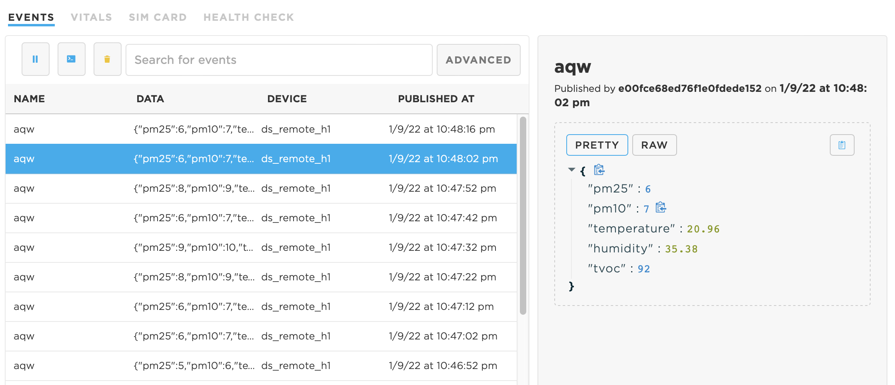

# Arduino/Particle

The Arduino library has been updated to work with V6! See the quickstart below.

Sample code is located here: [https://github.com/circuitdojo/air-quality-wing-code](https://github.com/circuitdojo/air-quality-wing-code)

Library is located here: [https://github.com/circuitdojo/air-quality-wing-library](https://github.com/circuitdojo/air-quality-wing-library)

## Quick Start:

**This quick start assumes you have [Particle Workbench](https://www.particle.io/workbench/) installed.**

1. Clone this repo onto a place on your machine: `git clone git@github.com:circuitdojo/air-quality-wing-code.git`
2. Init the library submodule using `git submodule update --init --recursive`
3. Open the repo with Visual Code: (`code .` using the command line, or `file`->`open`)
4. Open `/src/AirQualityWing.ino`
5. Select your target device in the lower bar (Options are: `argon` and `boron`)
6. Hit `cmd` + `shift` + `p` to get the command menu
7. Select `Compile application (local)`. You can also choose `Cloud flash` as long as `board.h` has not been modified.
8. Enjoy playing around with your Air Quality Wing!

This example has been tested with DeviceOS 3.1.0. It's recommended to upgrade if you have problems.
