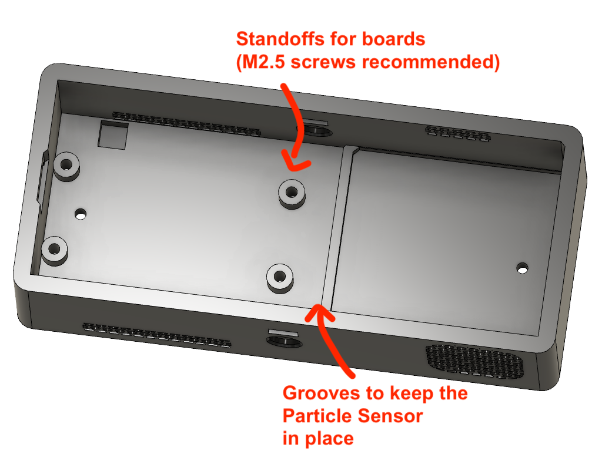

# Enclosure

The new enclosure will be open source and available soon. Currently still a work in progress.

## Original Enclosure

Download link:

[Click here to download all the .STL files and get printing!](downloads/Air%20Quality%20Wing%20Case%20-%20v54.zip)

The features:

- Detachable lithium battery compartment.
  - Maximum battery size:
  - Width:  ~114 mm
  - Length: ~48 mm
  - Height: ~31 mm (includes battery expansion wiggle room)
  - Secures with [M2.5 screws](https://www.mcmaster.com/96817a892)
- Precision openings for the Honeywell HPMA115S0
- Dual purpose top opening for Particle RGB LED and Ventilation
- No fastener clip top
- Enough room for the original AQW and Reduced Size Version (v5 and newer)
- Knock outs for antenna connection and battery connection
- USB port cutout to run off USB power

Here are a few photos:

#### Changelist

5/23/2020: *v54*
* Reduced the height slightly so the HPMA doesn't move as much

5/13/2020: *v53*

* Re-designed top snap
* Increased length to give more room for cables.
* Tweaked height for HPMA sensor (so it doesn't rattle around)
* Antenna break outs are real!
* USB fit improvements