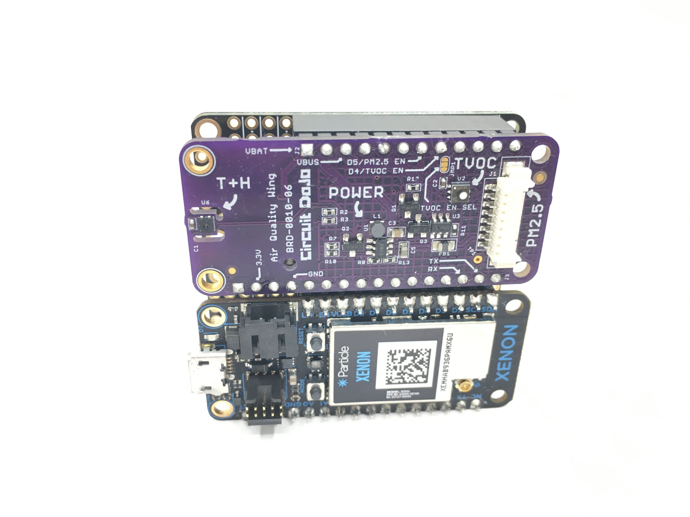

# Getting Started

There are a few ways you can get started with the Air Quality Wing. Here are some of the configurations you can put your board in depening on the application:

1. Headers soldered down for use with a Feather doubler or tripler

    This configuration is perfect if you need to interface with other Feather/Featherwings which already have headers soldered. Here is an example configuration below:

    

2. Header-up with (optional) battery backpack

    If you're tight on space, you can stack the Air Quality Wing with other Feather compatible boards vertically. Additionally you can solder the battery backpack to the "back" side so everything is together in one package.

    **TODO: show picture of this configuration**

3. Soldering wire connections directly to the board:

    If you are feeling adventureous, you can also solder direct wire connections to the I2C, power/ground and UART connections. Recommended for more custom or permanent projects.

    **TODO: show picture of this configuration**