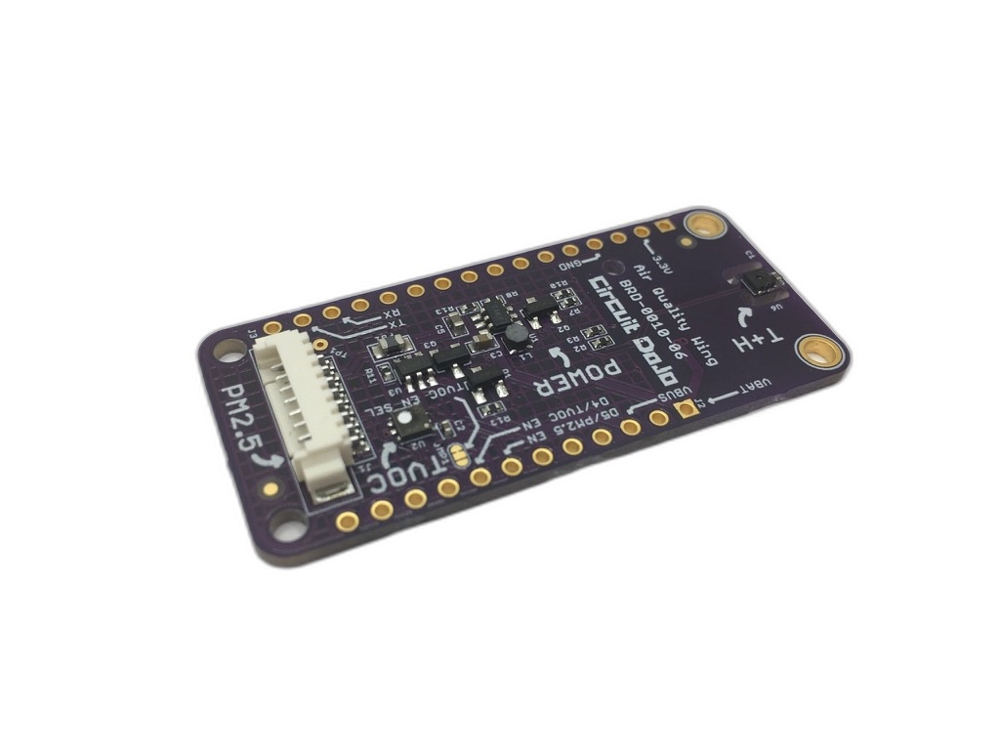
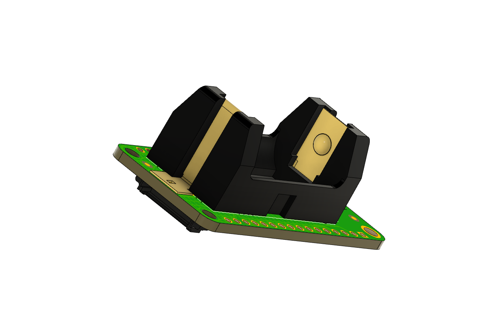

# Air Quality Wing

_Prototype of the Air Quality Wing v6 pictured._

## The Problem

As wildfires ravage parts of the USA and smog has loomed in our skies it’s become more important than ever to make sure you’re breathing clean air. Some folks may just go buy an air purifier. But, how do you know it works? How do you know if it’s powerful enough to protect your whole space?

Like a scientist, you can test it with an Air Quality Wing.

## What is it?

The Air Quality Wing is an all-in-one air quality sensor and development board. It brings together a trio of sensors to give you as many data points as possible. That way, there won’t be anything missing when you go to measure the air inside your home or workplace.

Here's what's included:

### Particulate Sensing

The most important sensor is the **Honeywell HPMA115S0 dust sensor** (available as a purchase option). This sensor counts the concentration of potentially harmful particulates in the air. It can detect both large particles 10µm in diameter and smaller ones less than 2.5µm in diameter. These readings are known as PM10 and PM2.5 respectively.

### Sensing Volatile Compounds

Second to that, is the **Sensirion SGP40**. This senses volatile organic compounds (VOCs). These types of readings are useful in places where there may be combustion. (Think stoves, furnaces, etc) It can act as an early warning mechanism. That way you stay safe, happy and healthy!

### Temperature and Humidity

Finally, the **Sensirion SHTC3** temperature and humidity sensor. These readings can be used on their own. Additionally they’re used by the SGP40 to compute an accurate TVOC.

### Flexible Power Sources

No outlet nearby where you want to measure? No problem!

You can easily plug in almost any lithium polymer battery to your Feather based development board board and use it immediately. The Air Quality Wing also has extra circuitry that allow you to switch between USB and battery without user input.

The Air Quality Wing also features an optional battery backpack which holds a 850mAh CR2 battery.

Simply solder it on and you're good to go!

## Software support

Drivers for Zephyr are nearly complete. [Drivers for Embedded Rust](rust-examples.md) are planned. All software and hardware is _open source_!

## Purchase

The Air Quality Wing is available for pre-order here: [https://www.circuitdojo.com/products/air-quality-wing](https://www.circuitdojo.com/products/air-quality-wing) Board will be shipping late September/Early October 2021.

## Previous versions

For more info on earlier versions of the Air Quality Wing [go here.](https://www.circuitdojo.com/documentation/air-quality-wing/)
