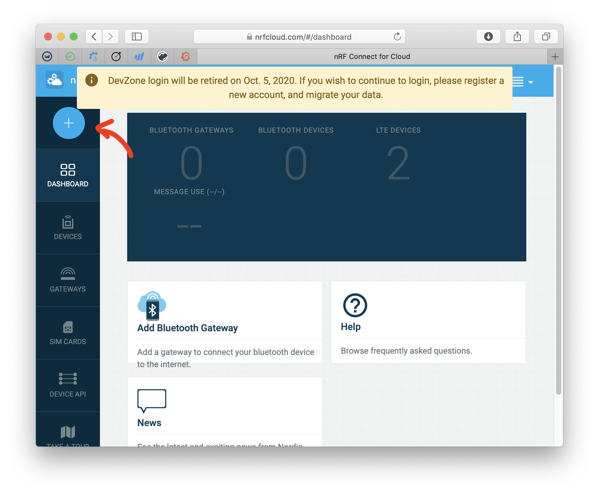
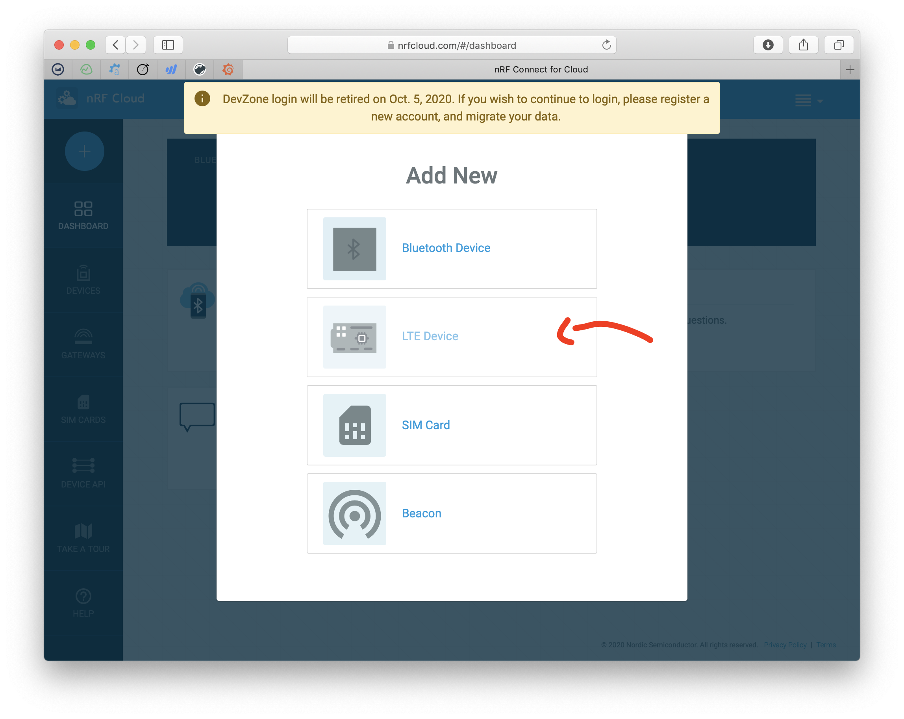
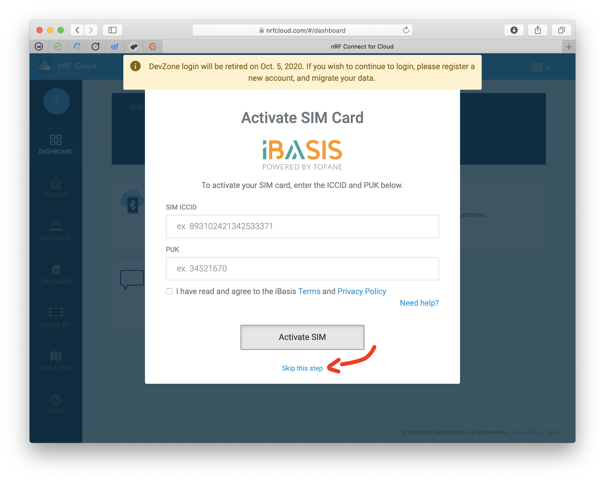
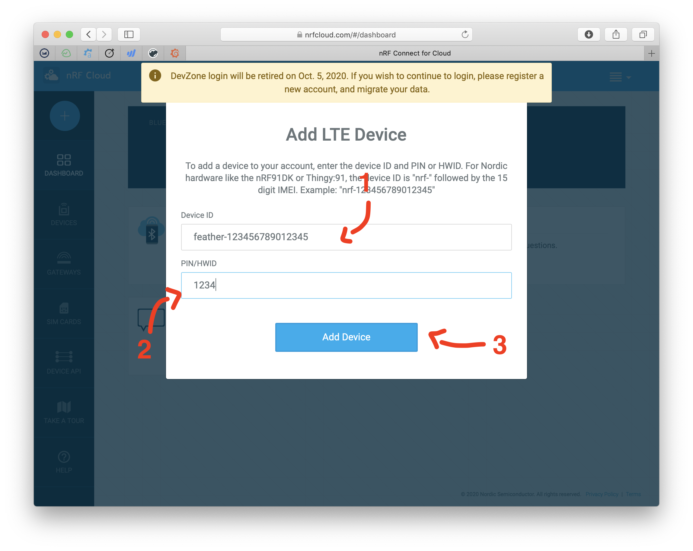
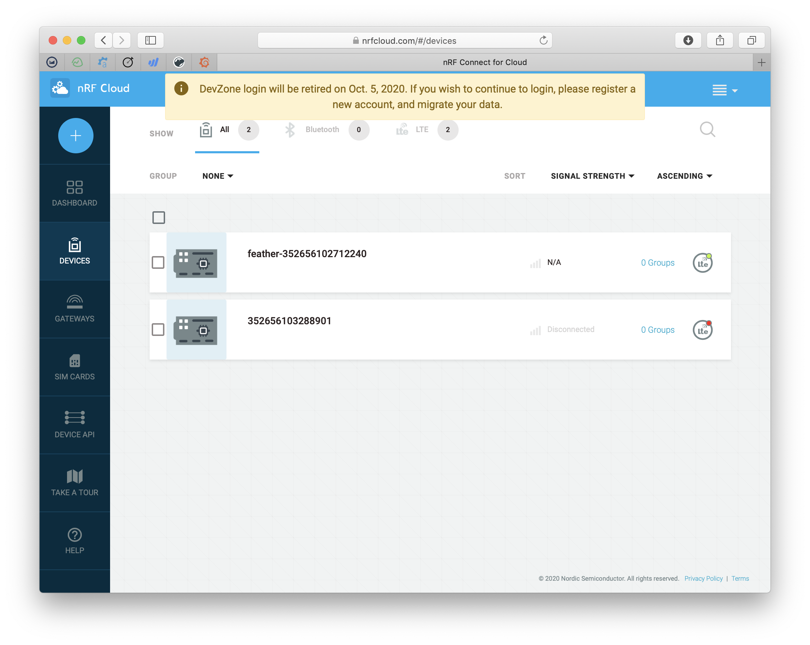
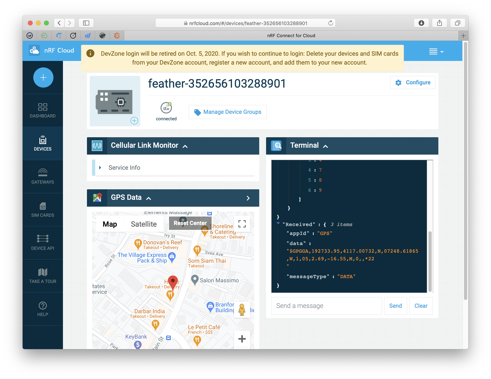

# nRF Cloud AGPS Sample

The `nrf_cloud_agps` sample is the *easiest* way to get started with generating GPS coordinates with your nRF9160 Feather.

## Programming `nrf_cloud_apgs` **Sample**

As of this writing, this example works best using the pre-release version of nRF Connect SDK. You can skip the compilation step and download the update binary [here](files/nrf_cloud_agps_bb259bf.bin).

1. Change directories to `ncs/nrf`
1. Make sure that you're running the latest master. Running `git fetch` and then  `git checkout bb259bfad1fa3572563444edb512fc8a6f12a3f4`.
1. Run `west update` to fetch all dependencies
1. Then change directories to `nrf/samples/nrf9160/nrf_cloud_agps/` (on the latest main branch it's changed to `/nrf/samples/nrf9160/agps/`)
1. Add this to `prj.conf`:
   ```
   # Cloud prefix for nRF9160 Feather
   CONFIG_NRF_CLOUD_CLIENT_ID_PREFIX="feather-"

   # Enable Zephyr application to be booted by MCUboot
   CONFIG_BOOTLOADER_MCUBOOT=y

   # COEX0 is used to enable the GPS LNA, but it has to be configured to do so.
   CONFIG_NRF9160_GPS_SET_COEX0=y
   CONFIG_NRF9160_GPS_COEX0_STRING="AT%XCOEX0=1,1,1565,1586"
   ```

Then compile as normal:

```
$ west build -b circuitdojo_feather_nrf9160ns
```

Then load using `newmgr`:

```
$ newtmgr -c serial image upload build/zephyr/app_update.bin
$ newtmgr -c serial reset
```

## Setting Up nRF Connect for Cloud

During factory test, your nRF9160 Feather is added to nRF Connect for Cloud for your immediate use! The only thing you'll need, other than your nRF9160 Feather, SIM and antenna is your getting started card:


Every nRF9160 Feather has a device ID generated based on the IMEI. Your full device ID will look something like:

`feather-<IMEI>` where `<IMEI>` is the IMEI tied to your specific device. You'll need this in a moment.

Here are the steps to get you the rest of the way.

1. First, program your device with the `nrf_cloud_agps` sample.
1. Then, power up and confirm that the device can connect to the cloud.
1. Create an nRF Connect for Cloud Account
   
1. Once created, go to the top left and click the big **+** icon.
   
1. Then skip the iBasis setup since we're using Hologram.
   
1. Enter the Device ID and the PIN provided on your card.
   
1. Once you press **Add Device**, nRF Connect for Cloud should notify you that your device has been added!
1. Navigate to **Devices** and click on the device you're working wtih!
   

That's it!

Your device screen will adapt to the example code that you're using. For example, it should display a map when you begin to publish GPS data.



### Troubleshooting

There are some things that can go wrong here. They're usually related to your nRF Cloud certs.

- [] Discuss downloading the certs again.
- [] Removing
- [] Reloading

All of this information is based on the [tutorial here.](https://infocenter.nordicsemi.com/index.jsp?topic=%2Fug_nrf91_dk_gsg%2FUG%2Fnrf91_DK_gsg%2Fupdating_certificates.html)
