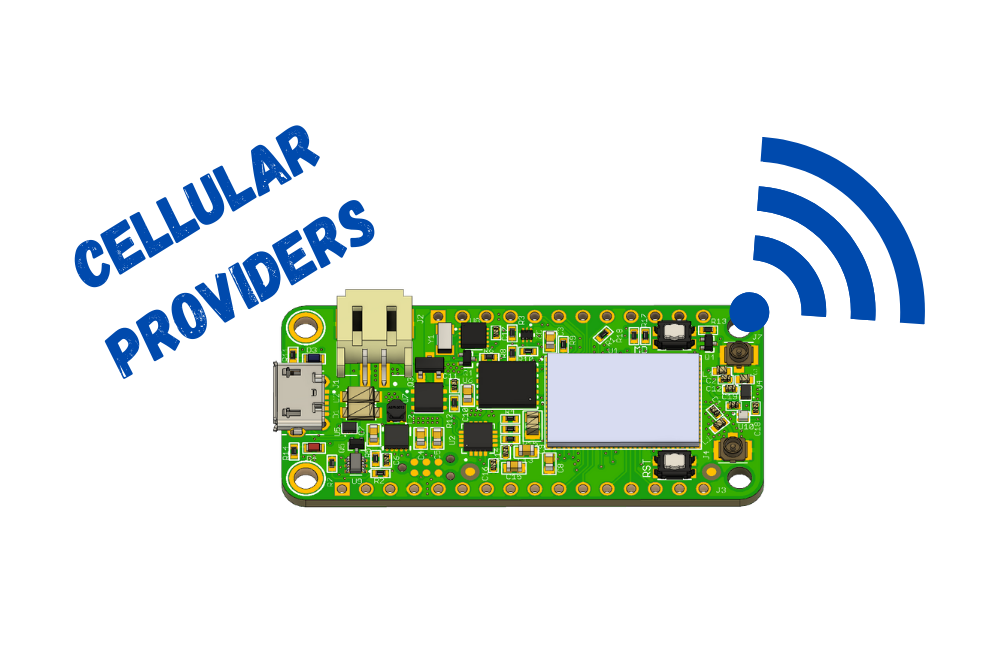

# Cellular Provider Matrix

Here are some results from recent testing of the nRF9160 Feather. As of this writing, the nRF9160 Fether is not an end certified deivce. That means there is limited support for all the known networks in the USA.

**Note:** End device certification is underway with Verizon! Estimated completion is mid to late August.

| Provider Name                | Connected To | Notes                                                                                        | Working | Recommended |
| ---------------------------- | ------------ | -------------------------------------------------------------------------------------------- | ------- | ----------- |
| Holigram                     | Sprint/AT&T  | The first SIM to get working out of the box. Also supports T-Mobile and Verizon connections. | ✅       | 👍👍          |
| Soracom                      | AT&T         | Tested previously with a different module in this location. Will test again with the nRF9160 | 🔶       |             |
| Verizon                      | Verizon      | Due to network contraints, currently only works in administrative mode.                      | 🔶       |             |
| Twilio (Standard Wireles)    | T-Mobile     | T-Mobile does not support the nRF9160.                                                       | 🔴       |             |
| Twilio (Standard Narrowband) | T-Mobile     | T-Mobile does not support the nRF9160.                                                       | 🔴       |             |
| Twilio (Super Sim)           | ?            | Untested.                                                                                    | 🔶       |             |
| AT&T                         | AT&T         | Untested.                                                                                    | 🔶       |             |

Emoji usage chart:

| Emoji | Note                                |
| ----- | ----------------------------------- |
| 👍     | Recommended. The more 👍 the better! |
| ✅     | Tested and working                  |
| 🔶     | In progress                         |
| 🔴     | Tested. Does not work!              |

💡**Side note:** unless otherwise noted these are tested along the shoreline of Connecticut. Your mileage may vary so make sure you do your own testing
before adopting a provider.

For the latest information on which providers support the nRF9160 SiP check out [Nordic's nRF9160 certification page.](https://www.nordicsemi.com/Products/Low-power-cellular-IoT/nRF9160-Certifications)