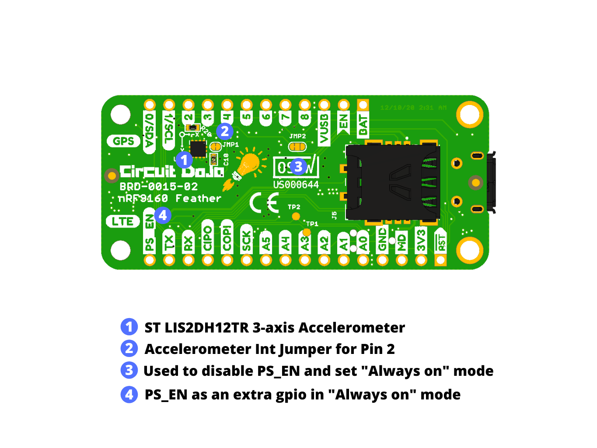

# Changelog

## Hardware

### v4 - (October 2021)

Changed:
* Changed power supply to use TI's LM3281
* USB connector to USB-C
* Changed schottky diode part to make more room for USB-C
* Updated 3D render
* Renamed LNA_EN to GPS_EN to avoid confusion
* Charging LED fed by 5V
* Replaced battery charger with Microchip MCP73830T
* Improved/cleaned up power and return paths
* INT1 is now an optional jumper

Added:
* Added INT2 connection for accelerometer with closed jumper
* A0 and MODE pin of LM3281 connected for PWM/PFM control

### v3 - (July 2021)

* Fixed SCL/SDA labels
* Added test points for SIM tests

### v2 - (Jan 2021)

* Added 3-axis Accelerometer by ST (LIS2DH12TR). Zephyr/nRF Connect SDK includes built-in support for this chip.
* Added Accelerometer INT1 pin to Pin 2 on the board. 
* Added JMP1 to free up use for Pin 2 (INT1 pin on LIS2DH is push/pull an always on)
* The power supply enable signal, which originally was inaccessible, is now available next to the TX pin. 
* Added JMP2 to disable PS_EN's connection to the power supply. "Always on" operation by shorting the middle and right pads on JMP2.
* Updated the bottom side labels thanks to Sparkfun's Buzzard tool. They deserve all the credit there!

## Software

### NFED (nRF9160 Feather Examples and Drivers) - (Jan 2021)
* Added accelerometer sample
* Added bme280 sample

## Documentation

### Uncommitted

**Changed**
* Changed note about compiling app
* Changed instructions about installing nRF Connect Desktop
* Fixed typo related to the bootloader-use section of Programming and Debugging
* Updated bootloader moe instructions
* Changed link to nRF53DK
* Fixed various typos
* Updated instructions for getting modem trace
* Install insructions updated to 1.5.0
* Adding entries to agps sample prj.conf

**Removed**
* Video for putting device into bootloader mode (outdated)
* 

**Added**
* Added a page about compatible cloud infrastructures
* Added some extra help related to newtgmr