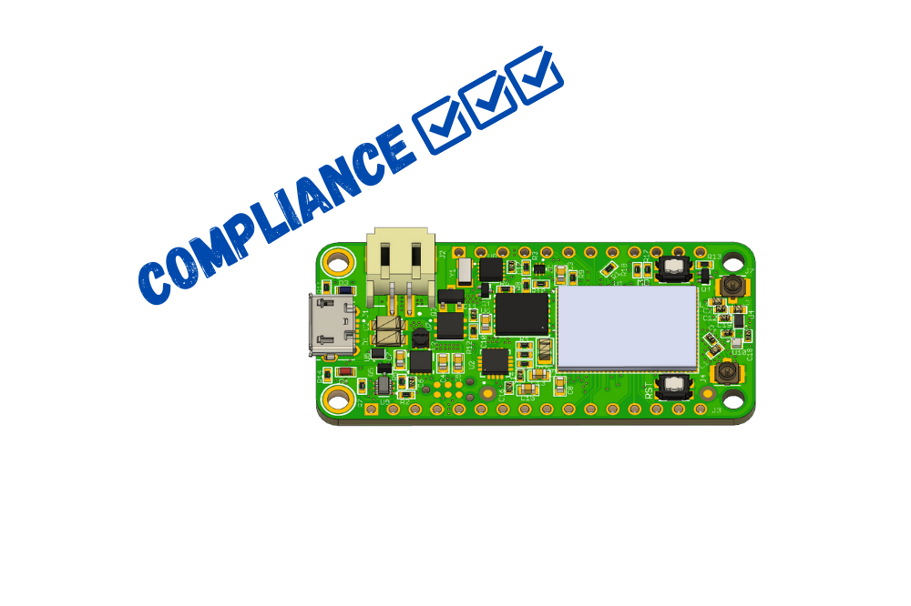

# Compliance

To make things easier for you, the nRF9160 Feather comes pre-tested and ready for integration. All applicable testing will be done to ensure comppliance with FCC and CE EMI/EMC requirements. See each section below for more information.

## CE Compliance

**Current status:** Not complete

## FCC Part15 Compliance

**Current status:** Not complete

## Markings

When designing the nRF9160 Feather into your own projects, there are some marking requirements. Per the instructions from Nordic, you must have this written on your product somewhere:

Contains FCC:

Contains IC:

