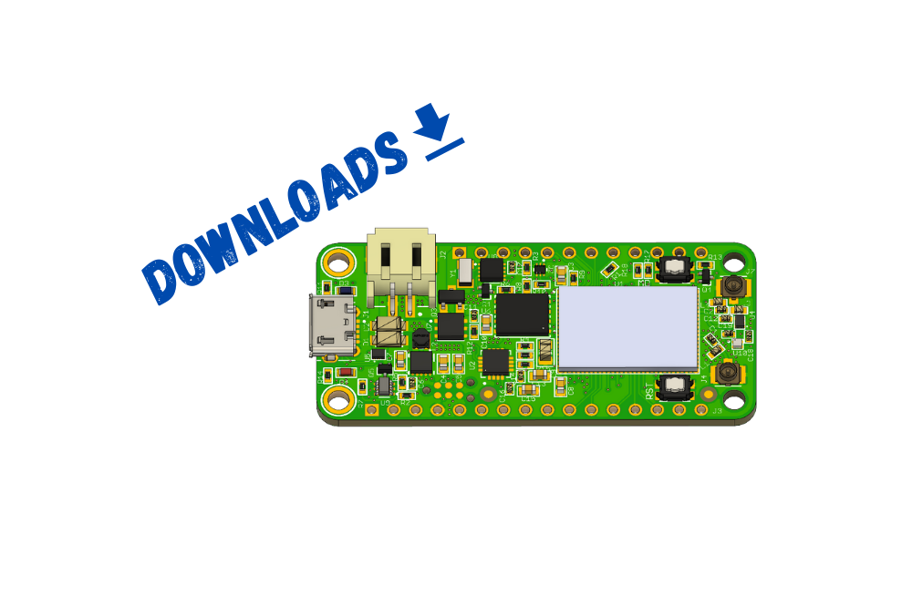

# Downloads

## Hardware Related

| Type              | Donwload Link                 |
| ----------------- | ----------------------------- |
| Documentation     | [Link to Github][github-docs] |
| Hardware          | [Link to Github][github-hw]   |
| Bill of Materials | [Link to Aligni][bom]         |
| 3D Model          | [Link to Github][github-hw]   |
| Enclosure         | [Link to Grabcad][grabcad]    |

## Software Related

| Type                       | Donwload Link             |
| -------------------------- | ------------------------- |
| Bootloader  (v1)           | [Link][bootloader]        |
| Bootloader  (v2)           | [Link][bootloader-v2]     |
| newtmgr CLI   (v1)         | [Link][newtmgr]           |
| Board Defintions (v1.3.x)  | [link][board-defs-v1.3.x] |
| Board Definitions (v1.2.x) | [link][board-defs-v1.2.x] |

[github-docs]: https://www.github.com/circuitdojo/docs/
[github-hw]: https://www.github.com/circuitdojo/nrf9160-feather/
[aligni]: https://www.aligni.com
[bom]: https://circuitdojo.aligni.com/part/380080?revision_id=402623#tab_part-list
[grabcad]: https://grabcad.com/library/nrf9160-feather-tracker-enclosure-1
[bootloader]: /files/nrf9160_feather_bootloader_v1.zip
[bootloader-v2]: /files/v2-010421-1502-merged.hex.zip
[newtmgr]: /nrf9160-programming-and-debugging.md#binary-download
[board-defs-v1.3.x]: files/board-definitions-ncs-v1.3.x.zip
[board-defs-v1.2.x]: files/board-definitions-ncs-v1.2.x.zip

## License

All hardware related files are available under the CERN v1.2 license. [Click here for more details.][cern]

All documentation is released under a Creative Commons Share-alike license. [Click here for more details.][cc-sa]

Any applicable software is released under the Apache 2.0 license. [Click here for more details.][apache-2]

[apache-2]: https://apache.org/licenses/LICENSE-2.0.html
[cern]: https://ohwr.org/project/cernohl/wikis/Documents/CERN-OHL-version-1.2
[cc-sa]: https://creativecommons.org/licenses/by-sa/4.0/legalcode