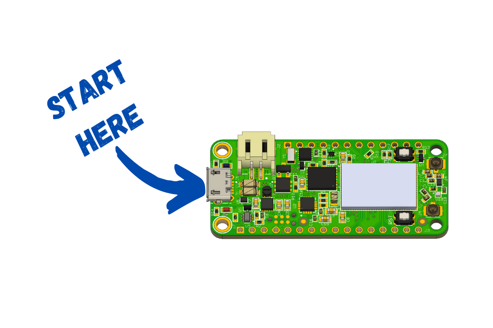

# Getting Started

## 🚨Read this first🚨

The nRF9160 Feater shouldn't be used with a battery less than 300mAH. More information in the [specs section.](./nrf9160-specs.md)

## What's included

- 1x nRF9160 Feather board
- 1x set of male headers (16 pin and 12 pin)
- 1x wide band cellular antenna

## Getting to know the hardware

### Soldering headers

### Connecting antennas

Once your headers are started you should *always* connect the LTE antenna before doing anything else.

Use finger to push on to the connector. You should get a nice *click*.
Removal, use your fingernail underneath and remove.

**Note** GPS isn't required before powering up but you will need it for GPS to work!

### Plugging in USB

### Connecting battery

### Using with Doubler/Tripler

### Using with Breadboard

### Sim usage

Insert into the bottom. Nano (4FF) size only.

Removal is the reverse of the above.

👍[More info on which providers to go with here.](./nrf9160-cellular-matrix.md)

## Setting up the toolchain

### Mac

### Windows

### Linux

## Programming code via bootloader

`mcumgr`
`nrfjprog`?

Speed is currently set to 115200 but hopefully that can be improved in the future!

## Programming code via nRF Connect Desktop

?

## Onboard USB-to-Serial

- Opening the SLAB_USBtoUART port on OSX. It will show up differently on PC.

## Programming Firmware

### Using J-Link

- Using tag connect. Link to example `blinky` firmware.
- nRF53 development board works best for programming
  - talk about shorting the jumper for permanent programming mode
  - using JTAG adapter board
- nrfjprog

### Using `pyocd` and CMCSIS-DAP

- ?

## Board Definition

- Where it's located/how to use.

