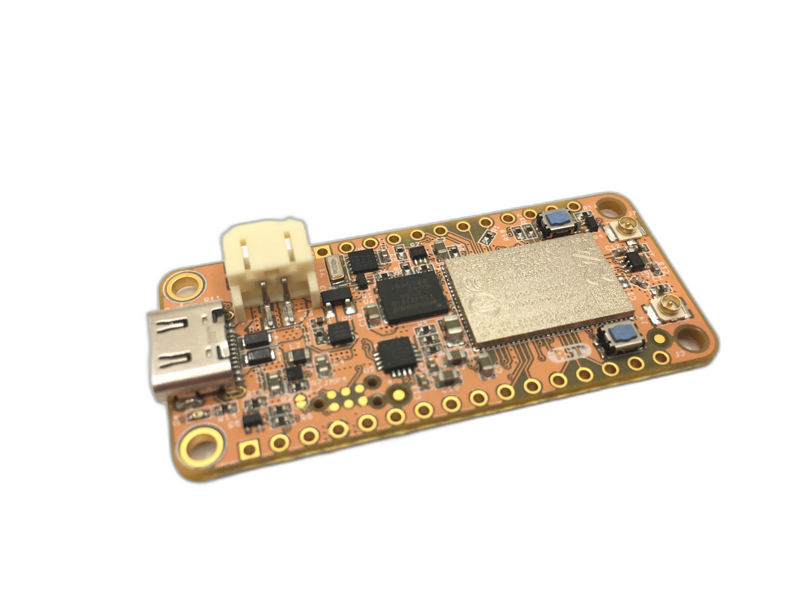

# Getting Started

## 🚨Read this first🚨

There are some important things about the nRF9160 Feather before you get started:

1. The nRF9160 Feater shouldn't be used with a battery less than 300mAH. More information in the [specs section.](./nrf9160-specs.md)
1. If you need to debug your nRF9160 Feather, it requires an external programmer. More information on that in the [Requirements for external programming](nrf9160-programming-and-debugging.md#requirements-for-external-programming) section.
2. If you're  new to Zephyr, be sure to check out the [Zephyr 101 series on Youtube](https://www.youtube.com/playlist?list=PLJKv3qSDEE-lYuq5hMpJ_sSHQcuhO1S-P)!
3. Looking for help? Check out the support forum: [https://community.jaredwolff.com](https://community.jaredwolff.com)

## What's included

- 1x nRF9160 Feather board
- 1x set of male headers (16 pin and 12 pin)
- 1x wide-band LTE antenna
- 1x getting started card
- 1x IoT SIM

## SDK and Development Environment Setup

Instructions below are based on using Microsoft's Visual Studio Code as your workspace. While you may choose a different editor, most of the steps remain the same.

- [Mac OS](nrf9160-sdk-setup-mac.md)
- [Windows](nrf9160-sdk-setup-windows.md)
- [Linux](nrf9160-sdk-setup-linux.md)

## Getting Started Sections

- [Compiling an Application](nrf9160-compiling-app.md)
- [Programming and Debugging](nrf9160-programming-and-debugging.md)
- [Serial Debug Usage](nrf9160-serial-usage.md)
- [nRF Connect For Desktop](nrf9160-nrf-connect-desktop.md)
