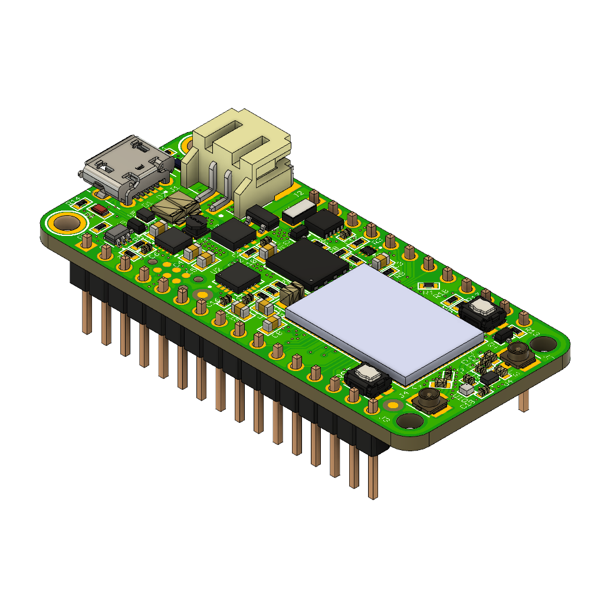

# Introduction to the nRF9160 Feather

The nRF9160 Feather by Jared Wolff (aka Circuit Dojo LLC) is an electronics development board. It features a Nordic Semiconductor nRF9160-SICA part. This part is capable of both CAT M1 LTE and NB-IoT for communication with the outside world. It's compatible primarily with Zephyr via the nRF Connect SDK. Other toolchains and languages coming soon to a Github repository near you.

## Technical Details

* Nordic nRF9160*
  * Microcontroller
    * ARM Cortex M33
    * 1MB Flash
    * 256kB RAM
    * ARM® TrustZone®
    * ARM® Cryptocell 310
    * Up to 4x SPI, I2C and UART with Easy DMA
    * I2S w/ EasyDMA
    * 4x PWM with EasyDMA
    * 12bit SADC with EasyDMA
    * 2x RTC
    * PPI (Programmable peripheral interconnect) interface
  * Radio
    * Transceiver and baseband
    * 3GPP LTE release 13 Category M1 and NB1 compliant
    * 3GPP release 14 NB2 compliant
    * GPS receiver (GPS L1 C/A supported) - Active antenna only.
    * RF Transceiver for global coverage supporting bands:
      *  Cat-M1: B1, B2, B3, B4, B5, B8, B12, B13, B14, B17, B18, B19, B20, B25, B26, B28, B66
       *  Cat-NB1/NB2: B1, B2, B3, B4, B5, B8, B12, B13, B17, B18, B20, B25, B26, B28, B66
    *  Supports 4FF Nano SIM
* Micro USB connection for USB-to-Serial and DFU
* Pre-programmed MCUBoot bootloader
* External NOR Flash by Winbond
  * 2MB of space
  * Max bus speed of 133MHz
  * Standard SPI
* Power supply
  * 3.3V Buck/Boost up to 0.9A of current draw
  * Operating range 2.8 to 5.5V
  * External LiPoly battery connection (JST SPH type)
  * LiPoly set to 300mA with indication
* Programmer
  * Capable of interfacing with Jlink and CMSIS-DAP based programmers
  * Use with a Tag Connect TC2030-CTX-NL over Serial Wire Debug (SWD)
* Low Power RTC on board for time keeping and as a low power wakeup source.
* User I/O
  * Standard feather form factor GPIOs (0.1" pitch)
  * 2x buttons (1 Reset, 1 General Purpose)
  * 1x Blue LED connected to D7
* Antenna connections:
  * 1x U.FL for LTE with matching network
  * 1x U.FL for active GPS antennas
* Feather form factor
  * 50.8mm x 22.86mm (2" x 0.9")

*\* nRF9160 tech specs provided from the nRF9160 Product Specification*

## Glamor Shots

