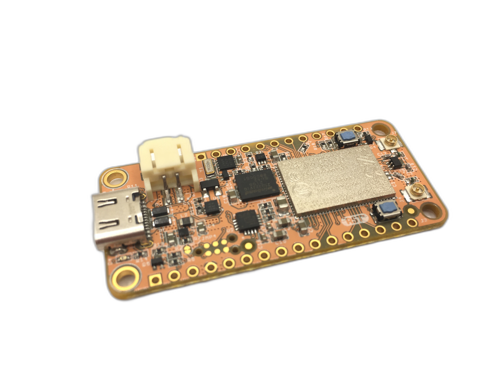

# Introduction to the nRF9160 Feather

The nRF9160 Feather by Jared Wolff (aka Circuit Dojo LLC) is an electronics development board. It features a Nordic Semiconductor nRF9160-SICA part. This part is capable of both CAT M1 LTE and NB-IoT for communication with the outside world. It's compatible primarily with Zephyr via the nRF Connect SDK. Other toolchains and languages coming soon to a Github repository near you.

