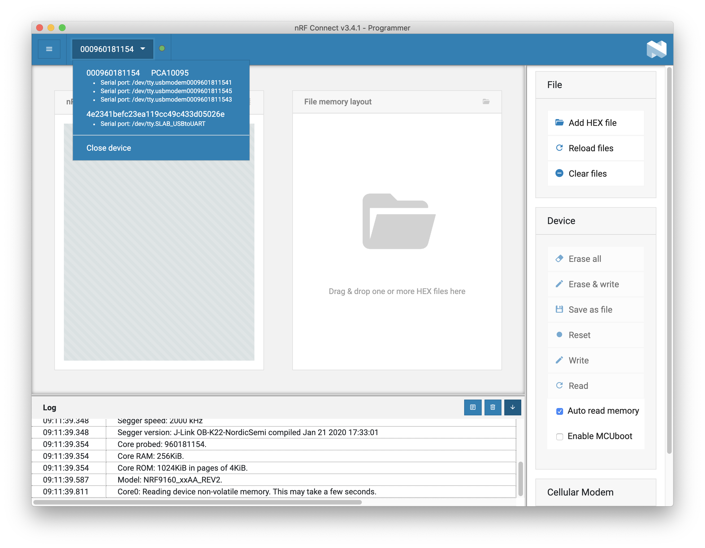
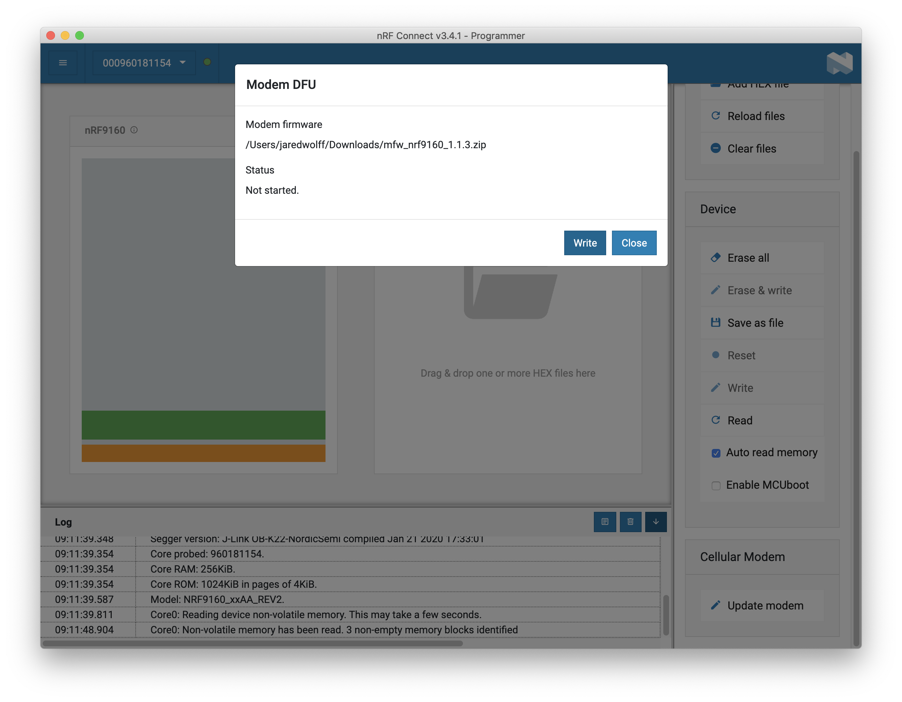

# Managing Modem Firmware

## Modem Firmware Update over UART

This sample can be used to load new modem firmware to your device using the _bootloader only_. This is useful if you do not have a programmer!

### Setup

Make sure you have the VSCode plugin installed and running. Here are the instructions for each major architecture:

- [Windows](https://docs.circuitdojo.com/nrf9160-sdk-setup-windows.html#installing-sdk)
- [Mac](https://docs.circuitdojo.com/nrf9160-sdk-setup-mac.html#installing-sdk)
- [Linux](https://docs.circuitdojo.com/nrf9160-sdk-setup-linux.html#installing-sdk)

### Get the modem firmware

Get your modem firmware of choice by nagivating to the [nRF9160 Download page](https://www.nordicsemi.com/Products/Development-hardware/nRF9160-DK/Download) and scrolling to the **nRF9160 SiP modem firmware** section:


Download the version you'd like to use.

**IMPORTANT:** currently nRF9160 Feather is shipped with version 1.3.2 of the modem firmware. **You cannot downgrade** according to Nordic.

### Build

Build the sample located in `samples/mfw_update` targeting `circuitdojo_feather_nrf9160_ns`.


### Loading

Then load to your device:


### Running Python script

First you need to install the dependencies by running the following within `samples/mfw_update/`:

```
pip3 install -r requirements.txt
```

With `python` installed you should be able to run the corresponding `update_modem.py` script easily:

```
python3 update_modem.py mfw_nrf9160_1.3.0.zip /dev/tty.SLAB_USBtoUART 1000000
```

**Note:** `update_modem.py` is located in NFED under the `nfed/samples/mfw_update/` path.

Here's what it should look like at the end of the process.


### Confirming

You can confirm you have the version you loaded by running the `AT+CGMR` AT Command using `at_client`:

```
The AT host sample started
> AT+CGMR
mfw_nrf9160_1.3.0
OK
```

## Modem Firmware Update with `nrfjprog`

The easiest way to update the modem firmware is using `nrfjprog`.

1. Connect your board via [Tag Connect cable](nrf9160-programming-and-debugging.md#requirements-for-external-programming) and to an nRF9160DK or nRF53DK.
1. Install [Nordic's Command Line Tools](https://www.nordicsemi.com/Products/Development-tools/nrf-command-line-tools/download) if you haven't already
1. Download the [modem firmware from Nordic](https://www.nordicsemi.com/Products/Development-hardware/nRF9160-DK/Download#infotabs) in the **nRF9160 SiP modem firmware** section.
1. Run the following in your terminal/shell:

```
❯ nrfjprog --program _bin/mfw_nrf9160_1.3.2.zip --reset
[ #################### ]   0.000s | Finding image components - Finished
[ #################### ]   0.056s | Upload segments - segment 2 of 2
[ #################### ]  43.186s | Uploading modem image - segment 2 of 2
WARNING: A programming operation has been performed without --verify.
WARNING: Programming can fail without error.
Applying system reset.
Run.
```

## Modem Firmware Update with nRF Connect for Desktop

To update, you can use nRF Connect for Desktop. It's important to note that not all firmware is certified to work on every provider. For a full up-to-date list, check out [Nordic's documentation](https://infocenter.nordicsemi.com/index.jsp?topic=%2Fstruct_nrftools%2Fstruct%2Fnrftools_nrfconnect.html).

**Another note:** you will need a [programmer and Tag Connect cable](nrf9160-programming-and-debugging.md#requirements-for-external-programming) in order to update the modem firmware.

Here are the instructions for updating your modem firmware:

1. [Download](https://www.nordicsemi.com/Products/Low-power-cellular-IoT/nRF9160/Download#infotabs) the modem firmware you need.
2. Next, open up the _Programmer_ in nRF Connect For Desktop. (You may need to open it first)
3. Then open up a connection to your programmer. (Your programmer should be connected to USB and attached to your nRF9160 Feather)
   
4. Once opened, the program will read the memory contents of your device and display it.
   
5. To update the modem firmware, scroll down to the bottom right and click **Update modem**
   
6. Find your modem firmware
   
7. Start the DFU process by clicking **Write**!
   

Then, your device will be updated. This process takes about _45 seconds_. You can check if the firmware version using the `AT+CGMR` AT command. Devices running on Verizon **must** use modem firmware v1.1.2.
