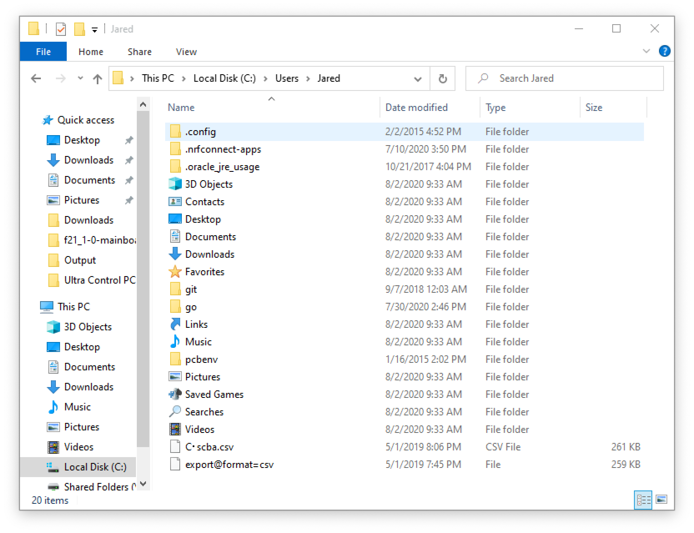
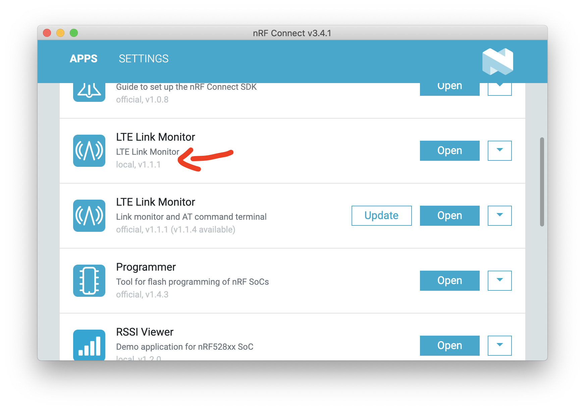

# nRF Connect Desktop

nRF Connect Desktop is *the* utility that you can use to manipulate your nRF9160 Feather. In this section we'll be focusing on two apps that will affect you the most:

1. LTE Link Monitor
1. Programmer

You can find the download page for [nRF Connect Desktop here.](https://www.nordicsemi.com/Software-and-tools/Development-Tools/nRF-Connect-for-desktop/Download#infotabs)

## LTE Link Monitor

The best way to debug anything cellular-related is to use the LTE Link Monitor. You will need to install a special one that I compiled specifically for the nRF9160 Feather. Here's the [LTE Link Monitor download](files/pc-nrfconnect-linkmonitor-1.1.6.tgz) (Version 1.1.6)

**What's the difference you ask?**

My version of LTE Link Monitor has a check box in the bottom right for enabling/disabling flow control. Future versions of the Link Monitor will have this feature rolled in. Make sure for the nRF9160 Feather that **you uncheck the Flow Control and Auto device/port filter checkboxes**  before connecting to your nRF9160 Feather.

To install:

1. Install nRF Connect Desktop app
1. Copy the LTE Link Monitor .tgz file to `%USERPROFILE%\.nrfconnect-apps\local` (on Windows) or `$HOME/.nrfconnect-apps/local` (on Linux/macOS). Here's an example of where it is on Windows:
   
1. Close and re-open nRF Connect Desktop (if it's open)
1. Then click *Open* next to the **local** version of LTE Link Monitor.

For more information check out [Nordic's Documentation.](https://nordicsemiconductor.github.io/pc-nrfconnect-docs/local_app_installation)

## Programmer

The programmer is excellent for updating your application firmware. The most important function it provides is *updating the modem firmware.*

### Updating Application Firmware

Another way of programming your application other firmware images is to use the nRF Connect Desktop Programmer App.

1. First, you'll need to install it if you haven't already.
1. Then open it up and select your programmer
   
1. Then add a hex file using the button on the right side.
   
1. Click **Browse** to loook for your file
   
1. Browse your Nordic Connect SDK repo for your file. For instance the `at_client` hex image is: `ncs/nrf/samples/nrf9160/at_client/build/zephyr/merged.hex`
   
1. Hit write to start the writing process. Remember your programmer **has to be connected** to the nRF910 Feather for this to work!
   

**Handy trick!** Since the nRF Connect Desktop app is web based, you can use (Command) ⌘ + R to refresh the program. (or CTRL + R on Windows/Linux) This is great when the app goes into a weird state or if your serial device/programmer is now showing up.

### Updating Modem Firmware

Your modem firmware plays an important role in the nRF9160. The easiest way, as of this writing, to update is to use the Programmer's **Update modem** function. It's important to note that not all firmware is certified to work on every provider. For a full up-to-date list, check out [Nordic's documentation](https://infocenter.nordicsemi.com/index.jsp?topic=%2Fstruct_nrftools%2Fstruct%2Fnrftools_nrfconnect.html).

Here are the instructions for updating your modem firmware:

1. [Download](https://www.nordicsemi.com/Products/Low-power-cellular-IoT/nRF9160/Download#infotabs) the modem firmware you need.
1. Next, open up the *Programmer* in nRF Connect Desktop. (You may need to open it first)
1. Then open up a connection to your programmer. (Your programmer should be connected to USB and attached to your nRF9160 Feather)
   
1. Once opened, the program will read the memory contents of your device and display it.
   
1. To update the modem firmware, scroll down to the bottom right and click **Update modem**
   
1. Find your modem firmware
   
1. Start the DFU process by clicking **Write**!
   

Then, your device will be updated. This process takes about *45 seconds*. You can check if the firmware version using the `AT+CGMR` AT command. Devices running on Verizon **must** use modem firmware v1.1.2.