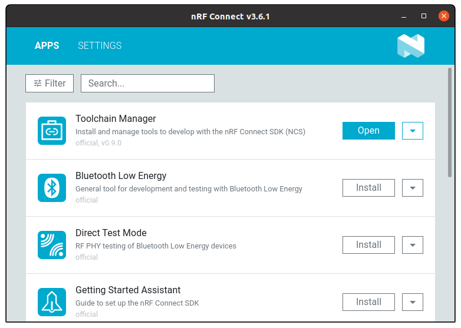

# nRF Connect For Desktop


- [nRF Connect For Desktop](#nrf-connect-for-desktop)
  - [LTE Link Monitor](#lte-link-monitor)
    - [Using with LTE Link Monitor](#using-with-lte-link-monitor)
  - [Programmer](#programmer)
    - [Updating Application Firmware](#updating-application-firmware)

nRF Connect For Desktop is *the* utility that you can use to manipulate your nRF9160 Feather. In this section we'll be focusing on two apps that will affect you the most:

1. [LTE Link Monitor](#lte-link-monitor)
1. [Programmer](#programmer)

You can find the download page for [nRF Connect For Desktop here.](https://www.nordicsemi.com/Software-and-tools/Development-Tools/nRF-Connect-for-desktop/Download#infotabs)

**Linux usesr:** nRF Connect for Desktop is distributed as an `appimage`. Right click and enable running as an executable. Then you can double click and run as any other app.




## LTE Link Monitor

The best way to debug anything cellular-related is to use the LTE Link Monitor.

To install:

1. (for OSX folks) If you haven't already, [install the Si2102 USB-to-Serial drivers.](https://www.silabs.com/products/development-tools/software/usb-to-uart-bridge-vcp-drivers)
3. Install [nRF Connect For Desktop app](https://www.nordicsemi.com/Software-and-Tools/Development-Tools/nRF-Connect-for-desktop)
4. Open it up and in the list of apps find **LTE Link Monitor**
5. Click **install**
6. Once installed click **open** and let the fun begin!
   

For more information check out [Nordic's Documentation.](https://nordicsemiconductor.github.io/pc-nrfconnect-docs/local_app_installation)

### Using with LTE Link Monitor

Almost any code example can be used with the AT Host Library. Generally all that is needed is adding these lines to your `prj.conf`:

```
# AT host library
CONFIG_AT_HOST_LIBRARY=y
CONFIG_UART_INTERRUPT_DRIVEN=y
```

Alternatively, for a quick start, simply program the [`at_client` example](nrf9160-at-client-sample.md) to your nRF9160 Feather. Then follow these quick steps to get up an running:

1. Insert your SIM into the nRF9160 Feather.
1. Attach your LTE antenna.
1. Plug your nRF9160 Feather into your computer's USB port.
1. Ensure that **Flow Control** is **turned off**, and **Show only supported devices.** is also **unchecked**.
   
2. Connect to it using the Device dropdown in the top left hand corner of the LTE Link Monitor.
   
   On *nix based systems, the port will show up like `/dev/tty.SLAB_USBtoUART`. On Windows, you'll have to determine which COM port is associated by using the device manager.
3. With **Automatic requests** turned on and the nRF9160 Feather connected, press the **AT+CFUN=1** button followed by the **AT+CFUN?** button. This will cause a few important commands to be automatically sent to your nRF9160 Feather.
   Additionally, your nRF9160 Feather will attempt to connect to the closest compatible tower possible.
4. Review the LTE Link Monitor for connection information.
   
   Yes, the LTE Link Monitor provides some great information. Consider it your go-to tool when debugging cellular or board related issues.

## Programmer

The programmer is excellent for updating your application firmware. The most important function it provides is *updating the modem firmware.*

### Updating Application Firmware

Another way of programming your application other firmware images is to use the nRF Connect For Desktop Programmer App.

1. First, you'll need to install it if you haven't already.
1. Then open it up and select your programmer
   
1. Then add a hex file using the button on the right side.
   
1. Click **Browse** to loook for your file
   
1. Browse your Nordic Connect SDK repo for your file. For instance the `at_client` hex image is: `ncs/nrf/samples/nrf9160/at_client/build/zephyr/merged.hex`
   
1. Hit write to start the writing process. Remember your programmer **has to be connected** to the nRF910 Feather for this to work!
   

**Handy trick!** Since the nRF Connect For Desktop app is web based, you can use (Command) ⌘ + R to refresh the program. (or CTRL + R on Windows/Linux) This is great when the app goes into a weird state or if your serial device/programmer is now showing up.