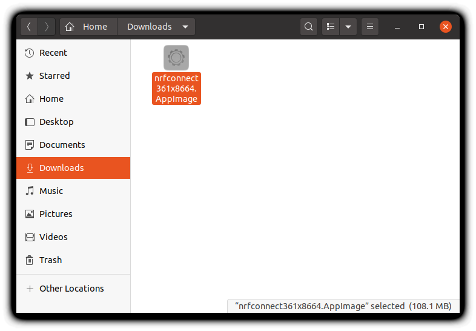

# nRF Connect For Desktop


nRF Connect For Desktop is *the* utility that you can use to manipulate your nRF9160 Feather. In this section we'll be focusing on two apps that will affect you the most:

1. [LTE Link Monitor](#lte-link-monitor)
1. [Programmer](#programmer)

You can find the download page for [nRF Connect For Desktop here.](https://www.nordicsemi.com/Software-and-tools/Development-Tools/nRF-Connect-for-desktop/Download#infotabs)

**Linux usesr:** nRF Connect for Desktop is distributed as an `appimage`. Right click and enable running as an executable. Then you can double click and run as any other app.




## LTE Link Monitor

The best way to debug anything cellular-related is to use the LTE Link Monitor.

To install:

1. Install [nRF Connect For Desktop app](https://www.nordicsemi.com/Software-and-Tools/Development-Tools/nRF-Connect-for-desktop)
1. Open it up and in the list of apps find **LTE Link Monitor**
1. Click **install**
1. Once installed click **open** and let the fun begin!
   

For more information check out [Nordic's Documentation.](https://nordicsemiconductor.github.io/pc-nrfconnect-docs/local_app_installation)

### Using with LTE Link Monitor

Almost any code example can be used with the AT Host Library. Generally all that is needed is adding these lines to your `prj.conf`:

```
# AT host library
CONFIG_AT_HOST_LIBRARY=y
CONFIG_UART_INTERRUPT_DRIVEN=y
```

Alternatively, for a quick start, simply program the [`at_client` example](nrf9160-at-client-sample.md) to your nRF9160 Feather. Then follow these quick steps to get up an running:

1. Insert your SIM into the nRF9160 Feather.
1. Attach your LTE antenna.
1. Plug your nRF9160 Feather into your computer's USB port.
1. Ensure that **Flow Control is turned off,** and **Auto device/port filter is also unchecked.**
   
1. Connect to it using the Device dropdown in the top left hand corner of the LTE Link Monitor.
   
   On *nix based systems, the port will show up like `/dev/tty.SLAB_USBtoUART`. On Windows, you'll have to determine which COM port is associated by using the device manager.
1. With **Automatic requests** turned on and the nRF9160 Feather connected, press the **AT+CFUN=1** button followed by the **AT+CFUN?** button. This will cause a few important commands to be automatically sent to your nRF9160 Feather.
   Additionally, your nRF9160 Feather will attempt to connect to the closest compatible tower possible.
1. Review the LTE Link Monitor for connection information.
   
   Yes, the LTE Link Monitor provides some great information. Consider it your go-to tool when debugging cellular or board related issues.

## Programmer

The programmer is excellent for updating your application firmware. The most important function it provides is *updating the modem firmware.*

### Updating Application Firmware

Another way of programming your application other firmware images is to use the nRF Connect For Desktop Programmer App.

1. First, you'll need to install it if you haven't already.
1. Then open it up and select your programmer
   
1. Then add a hex file using the button on the right side.
   
1. Click **Browse** to loook for your file
   
1. Browse your Nordic Connect SDK repo for your file. For instance the `at_client` hex image is: `ncs/nrf/samples/nrf9160/at_client/build/zephyr/merged.hex`
   
1. Hit write to start the writing process. Remember your programmer **has to be connected** to the nRF910 Feather for this to work!
   

**Handy trick!** Since the nRF Connect For Desktop app is web based, you can use (Command) ⌘ + R to refresh the program. (or CTRL + R on Windows/Linux) This is great when the app goes into a weird state or if your serial device/programmer is now showing up.

### Updating Modem Firmware

Your modem firmware plays an important role in the nRF9160. The easiest way, as of this writing, to update is to use the Programmer's **Update modem** function. It's important to note that not all firmware is certified to work on every provider. For a full up-to-date list, check out [Nordic's documentation](https://infocenter.nordicsemi.com/index.jsp?topic=%2Fstruct_nrftools%2Fstruct%2Fnrftools_nrfconnect.html).

**Another note:** you will need a [programmer and Tag Connect cable](nrf9160-programming-and-debugging.md#requirements-for-external-programming) in order to update the modem firmware.

Here are the instructions for updating your modem firmware:

1. [Download](https://www.nordicsemi.com/Products/Low-power-cellular-IoT/nRF9160/Download#infotabs) the modem firmware you need.
1. Next, open up the *Programmer* in nRF Connect For Desktop. (You may need to open it first)
1. Then open up a connection to your programmer. (Your programmer should be connected to USB and attached to your nRF9160 Feather)
   
1. Once opened, the program will read the memory contents of your device and display it.
   
1. To update the modem firmware, scroll down to the bottom right and click **Update modem**
   
1. Find your modem firmware
   
1. Start the DFU process by clicking **Write**!
   

Then, your device will be updated. This process takes about *45 seconds*. You can check if the firmware version using the `AT+CGMR` AT command. Devices running on Verizon **must** use modem firmware v1.1.2.