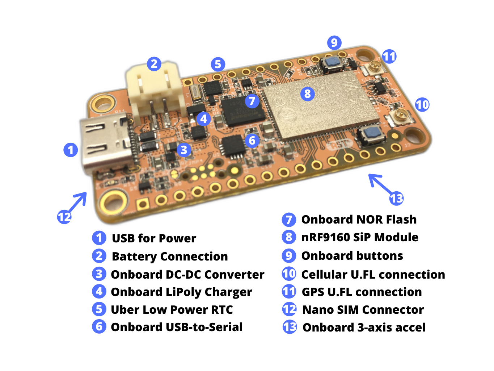
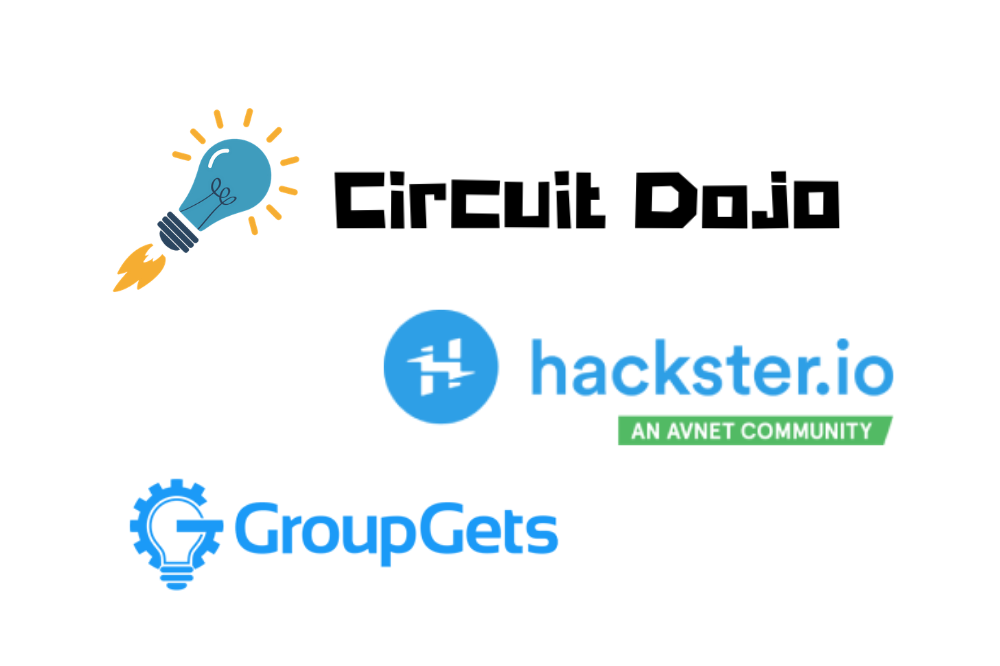

# Overview

This board can be powered several ways. The most popular way to power Feather boards is by using the USB port. This board is no exception. It works well across both USB and LiPoly batteries.

The board is designed from the ground up to be power efficient at the most used power state: _standby._ That's right, if you're developing something that's battery powered, your most used state will usually be standby mode. As of this writing the estimated current draw in this state should be < 10µA @ 3.6V (VBat). That's approximately 1.71 years on a 150mAH cell!

Speaking of power, this board also has a fully fledged DC/DC Buck with an atonishing <1uA quiescent current!

This board also sports some external flash for storing your application data. Use it with the built in support for LittleFS in Zephyr. Or, use one of your choice! What ever tickles your fancy.

Finally, but not least, the nRF9160. I've been watching this part very carefully since the CEO had it locked in a mysterious black case years back. It's here and it's real and the module is half the price of other modules. I won't bore you with all the technical details. (Technical details get you excited? [Go here.](https://www.nordicsemi.com/Products/Low-power-cellular-IoT/nRF9160)) Needless to say, it's awesome.

I'll be launching in collaboration with the awesome folks at [Hackster.io](https://www.hackster.io/launch) and [GroupGets](https://groupgets.com). We're all very excited to bring these boards to you!

If you want real-time updates, [sign up here](https://www.circuitdojo.com/products/nrf9160-feather) and i'll stay in touch. I can't wait to share more with you!
