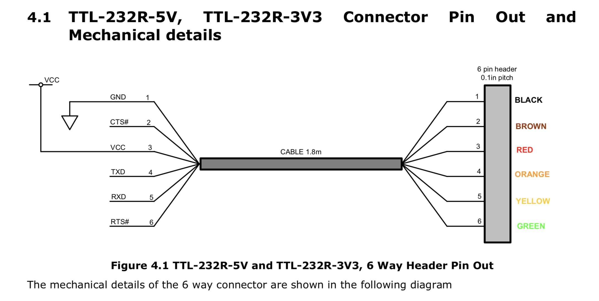
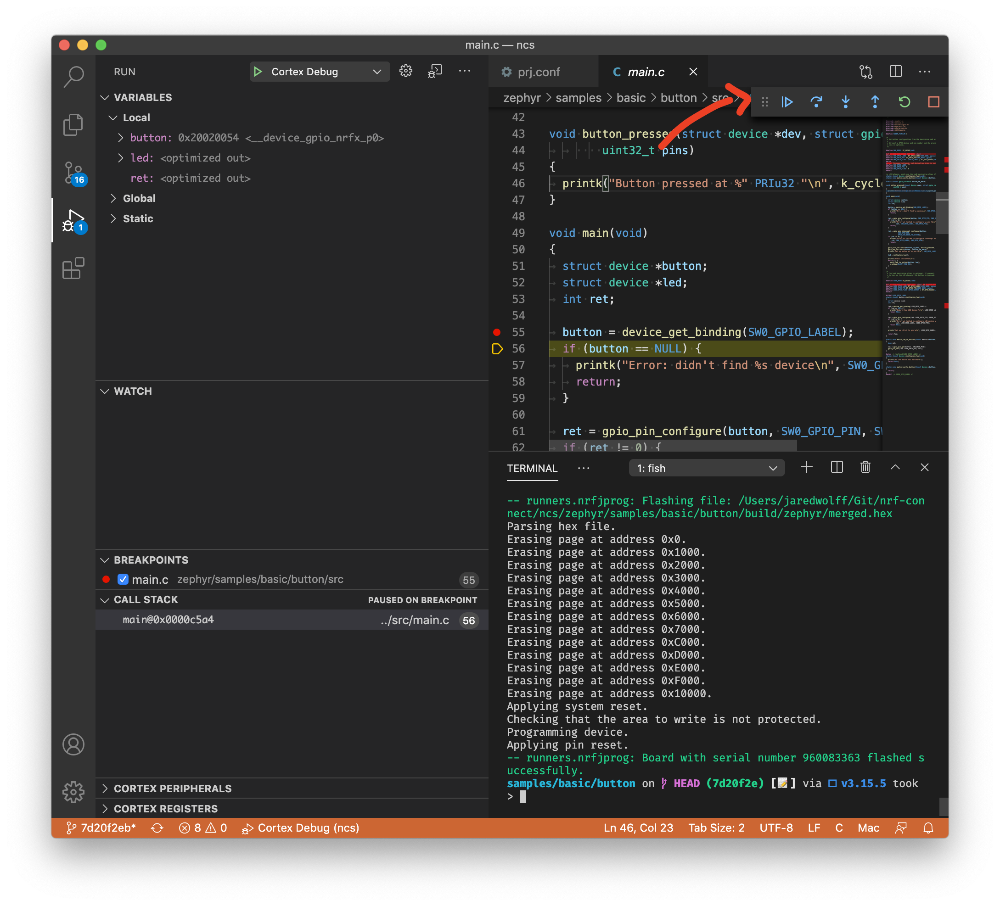

# Programming and Debugging

There are currently two ways of programming the nRF9160 Feather. You can use the built-in bootloader or use an external programmer.

- [Bootloader use](#booloader-use)
- [External programming](#requirements-for-external-programming)
- [Modem trace](#getting-a-modem-trace)
- [Debugging in Visual Code](#debugging-in-visual-code)

## Booloader use

Currently the nRF9160 Feather uses the MCUBoot bootloader which comes standard with the nRF Connect SDK. It is the recommended way to load new firmware onto your nRF9160 Feather.

In order to utilize the bootloader, you'll ned to install `newtmgr` (AKA `mcumgr`). Here's how below:

**IMPORTANT:** updates above ~192kB will not work with the current version of the bootloader. Examples like the `asset_tracker` require a programmer.

### Binary Download

Download one of the binary files below. (Install script coming soon...)

- [Windows](files/newtmgr/windows/newtmgr.exe.zip)
- [Mac OSX](files/newtmgr/darwin/newtmgr.zip)
- [Linux](files/newtmgr/linux/newtmgr.zip)

Then place that file in your `$PATH`. On Linux and OSX that location will be `/usr/local/bin`. On Windows you can place the file in a location of your choice. Then, you'll have to update your `$PATH`. If you're unfamailiar with the process check out [this guide.](https://helpdeskgeek.com/windows-10/add-windows-path-environment-variable/)

### Setting your connection configuration (one time only)

In order to easily work with `newtmgr` you'll need to make a one-time connection profile.

<script id="asciicast-352234" src="https://asciinema.org/a/352234.js" async data-rows="10"></script>

**For Mac OS**

```
newtmgr conn add serial type=serial connstring='dev=/dev/tty.SLAB_USBtoUART,baud=1000000'
```

**For Linux**

```
sudo newtmgr conn add serial type=serial connstring="dev=/dev/ttyUSB0,baud=1000000"
```

Depending on your system, the serial port may show up differently. Replace `/dev/ttyUSB0` with the serial port name. Also, `sudo` is required for Linux to access the serial port properly.

**For Windows**

```
newtmgr conn add serial type=serial connstring="dev=COM3,baud=1000000"
```

In all three cases above you've created a connection called `serial`. We'll be using that when issuing commands to the nRF9160 Feather.

## Using `newtmgr`

<center><video width="100%" class="video" poster="/img/screencap.png" controls preload>
    <source src="/video/dfu_update.mp4" type="video/mp4">
    Your browser does not support the video tag.
</video></center>

**Pre-check:** MCUBoot *needs* to be enabled in your project before you can use it! Make sure that you have `CONFIG_BOOTLOADER_MCUBOOT=y` in your `prj.conf`

1. Put your nRF9160 Feather into DFU mode.
   1. Hold the MODE button
   1. Then tap the RST button while holding mode
   1. Let go of the MODE button
1. Building your application if you haven't already with `west build`. It will create a folder called `build`. The file we care about is `build/zephyr/app_update.bin`
1. Load the file using `newtmgr`
    1. Load the binary file using: `newtmgr -c serial image upload build/zephyr/app_update.bin`
    1. Reset your board using `newtmgr -c serial reset` or hit the **RST** button. Full process below:
    <script id="asciicast-352227" src="https://asciinema.org/a/352227.js" async  data-rows="10"></script>

**Note:**

1. The transfer process is limited to 1M BAUD. In most cases it takes about 8 seconds to transfer application code.
1. The nRF9160 Feather does not respond to `newtmgr` commands **unless it's in DFU mode**. (See step 1 above to get it into DFU mode.)

## Requirements for external programming

You can also use external programmers with the nRF9160 Feather. Here are the current supported external programmers:

1. [nRF5340-PDK](https://www.nordicsemi.com/Software-and-tools/Development-Kits/nRF5340-PDK)
1. [nRF9160-DK](https://www.nordicsemi.com/Software-and-tools/Development-Kits/nRF9160-DK)

**Note:** Most commercial J-Link programmers \*should\* work with the nRF9160 Feather. In particular the [J-Link EDU Mini](https://www.segger.com/products/debug-probes/j-link/models/j-link-edu-mini/) is a great choice if you're building non-commercial products. (Supports Cortex M33 processors. Untested at this time.)

**🚨Important:** the nRF52 and nRF51 based development kits **do not work** with the nRF9160 Feather!

👉Additionally, you'll also need a Tag-Connect cable. The nRF9160 Feather was designed to use the TC2030-CTX-NL. For more information check out [Tag-Connect's product page.](https://www.tag-connect.com/product/tc2030-ctx-nl-6-pin-no-legs-cable-with-10-pin-micro-connector-for-cortex-processors)

## Installing programmer software

In this next section, I'll be focusing on using the nRF5340-PDK as *the* programmer of choice. These steps should not be different from other J-Link supported boards.

1. Download your version of the [nRF Command Line Tools](https://www.nordicsemi.com/Software-and-tools/Development-Tools/nRF-Command-Line-Tools/Download#infotabs)

### Windows

2. Then, run the `.exe` that was downloaded. It will do all the heavy lifting for you.
3. Run `nrfjprog` in a `cmd` window to make sure your install is working.

### Mac

2. First run `nRF-Command-Line-Tools_10_9_0_OSX.pkg`
3. Once that install is done, run `JLink_MacOSX_V680a.pkg`
4. Open a fresh terminal window and run `nrfjprog` to make sure your install is complete.

## Setting up the nRF5340-PDK

Here are a couple of close up shots of how to connect the nRF5340-PDK:


I highly recommend you jump *SB47* on your nRF5340-PDK with some solder. This forces the debugger to think an external devices is permanently connected. If you're only doing external debugging, this is very useful.


After hooking things up, It's time to do a quick smoke test. Running `nrfjprog -r` in a terminal should show this result:

```jsx
$ nrfjprog -r
Applying system reset.
Run.
```

Success!

**Note:** these pictures are with an early version of the nRF9160 Feather. The procedure is the same. The orientation of the Tag-Connect though is horizontal not vertical as seen in the pictures.

## Programming with the nRF5340-PDK

Programming with the nRF5340-PDK is straight forward in Zephyr using `west`. Here's what it looks like:

```bash
west build -b circuitdojo_feather_nrf9160ns -p
west flash --runner nrfjprog
nrfjprog -r
```

In the above, i'm:

1. Doing a pristine build of my application with the nRF9160 Feather as the target.
1. Then flashing using the `nrfjprog` runner option. This is preferred for all J-Link boards.
1. Resetting the board using `nrfjprog -r`. As of this writing, `west` does not reset the board after programming.

## Getting a modem trace

Sometimes, you may be requested to get a modem trace of your device. This section will focus on helping you get one for your nRF9160 Feather.

In order to get a modem trace, the TX and RX pins on your board need to be free. You'll also need a UART to USB adapter of some type. I used an FTDI one that has each of the lines broken out.

1. First, set your `prj.conf` to include the following lines:

    ```
    # Enable modem trace
    CONFIG_BSD_LIBRARY_TRACE_ENABLED=y

    # AT host library
    CONFIG_UART_INTERRUPT_DRIVEN=y
    CONFIG_AT_HOST_LIBRARY=y
    ```

2. Then, create a folder in your project/sample called `boards` and add a new file called `circuitdojo_feather_nrf9160ns.overlay` We'll want to enable the UART1 interface on pins 23 and 24 like below:

    ```
    /*
    * Copyright (c) 2020 Circuit Dojo LLC
    *
    * SPDX-License-Identifier: Apache-2.0
    */

    &uart1 {
    status = "okay";
    current-speed = <115200>;
    tx-pin = <24>;
    rx-pin = <23>;
    };
    ```

3. Connect your USB to UART adatper. I've used clips from my logic analyzer to hold the wires in place. Connect the **yellow** wire to the TX on the board. Connect the **orange** wire to the RX on the board.

    

4. Then, inside LTE link monitor enable the process with `AT%XMODEMTRACE=1,2`. Then execute `AT+CFUN=0`. This will perpetually save and keep modem traces **on**.
5. Then open the serial port in the modem trace App and click start.

    

6. Then run your app as normal. You should see the **Trace size** go up little by little as connections are made, etc.

    

7. Then grab the file according to the log output. For example: `Tracefile created: /Users/jaredwolff/Library/Application Support/nrfconnect/pc-nrfconnect-tracecollector/trace-2020-09-16T20-47-19.741Z.bin`

    For more information, check out Nordic's [original article](https://devzone.nordicsemi.com/nordic/cellular-iot-guides/b/getting-started-cellular/posts/how-to-get-modem-trace-using-trace-collector-in-nrf-connect) on the subject.

## Debugging in Visual Code

Debugging your application is possible with Visual Code. You will need a J-Link programmer and a Tag Connect ([TC2030-CTX-NL](https://www.tag-connect.com/product/tc2030-ctx-nl-6-pin-no-legs-cable-with-10-pin-micro-connector-for-cortex-processors)) cable for this process. [Programmers include the nRF9160 DK, nRF532 DK, J-Link EDU](#requirements-for-external-programming) (if your project is non-profit) and the standard commercial J-Link programmers.

Here's the process:

1. Install the **C/C++ Extension** and the **Cortex-Debug** extensions. They're both very handy in development and debugging of Zephyr based projects.
    
    
1. If you don't have one already, create a `.vscode` folder in the **root** of your project.
    
1. Create a file called `launch.json`. This is where we'll set up the configuration for debugging.
1. Here's a real example of a config I was using to debug a project:
   ```
   {
     // Use IntelliSense to learn about possible attributes.
     // Hover to view descriptions of existing attributes.
     // For more information, visit: https://go.microsoft.com/fwlink/?linkid=830387
     "version": "0.2.0",
     "configurations": [
       {
         "name": "Cortex Debug",
         "cwd": "${workspaceRoot}",
         "executable": "${workspaceRoot}/pyrinas/applications/dreamstars/build/zephyr/zephyr.elf",
         "request": "launch",
         "type": "cortex-debug",
         "servertype": "jlink",
         "device": "nrf9160_xxAA",
         "interface": "swd",
         "armToolchainPath": "/Users/jaredwolff/gcc-arm-none-eabi-9-2019-q4-major/bin"
       }
     ]
   }
   ```
1. Change the **executable** path and the **armToolchainPath** to reflect your system. Make sure you point the **executable** option to the `.elf` file that gets produced during the compilation process.
1. Next, go to your projects `prj.conf` and disable the bootloader by **commenting out** `CONFIG_BOOTLOADER_MCUBOOT=y` or changing the `y` to a `n`. As of this writing, disabling the bootloader **is required** as it prevents the debugging process from occuring.
1. In `prj.conf` you'll also want to enable the `CONFIG_DEBUG` option. This disables compiler optimizations which makes the debug process hairy or impossible.
1. Finally, program your project using `west build && west flash`
1. At this point, if you've ever done any debugging in Visual Code, you should be able to follow the final steps to debug your application!
1. Set some breakpoints in your code by pressing the line number you want. A red dot will appear where the breakpoint is set.
    
1. Start debugging by clicking the debug icon on the left. Then click the **play** button in the top left.
    
    
1. You can use the popup menu on the right to control traversal through your code.
    