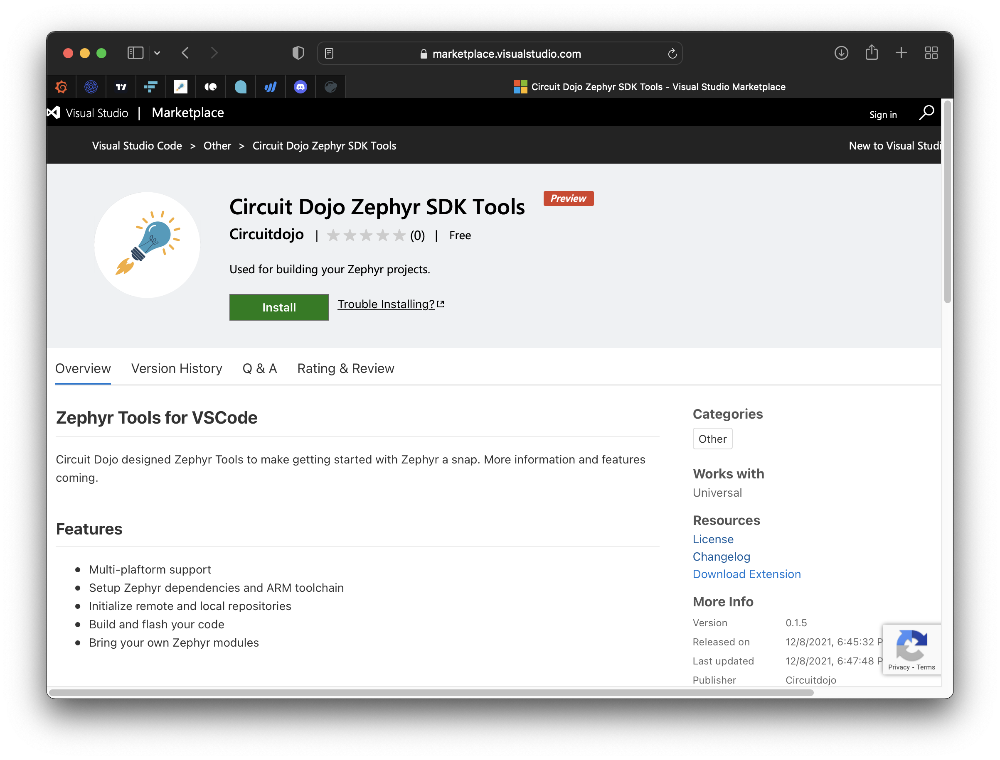
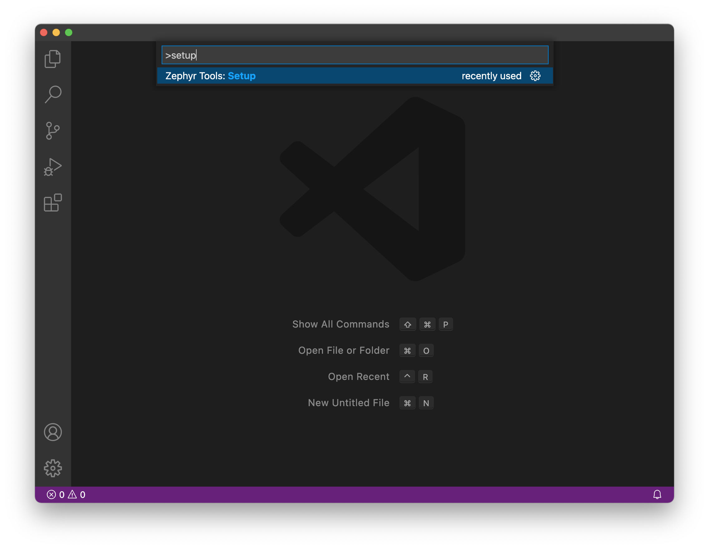
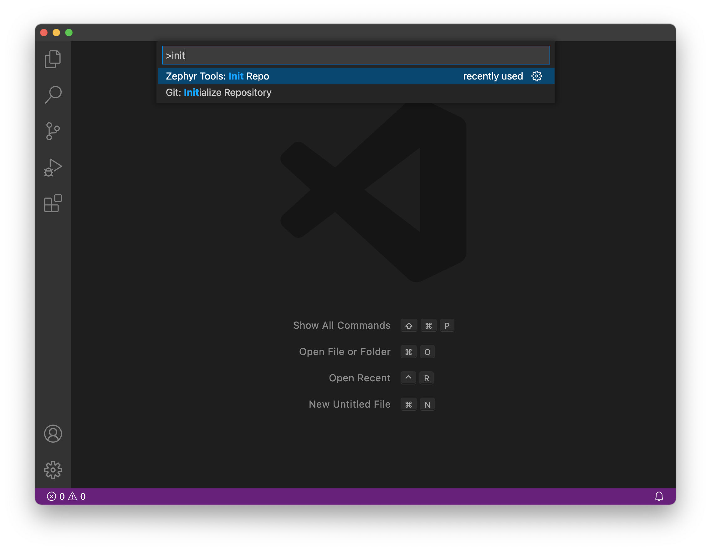
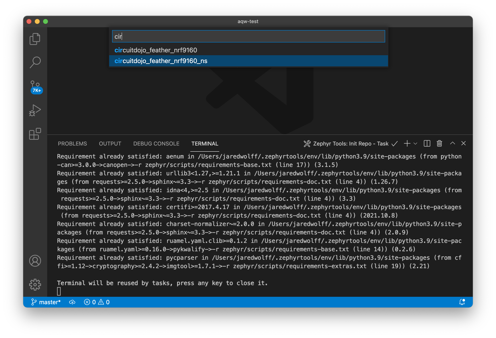
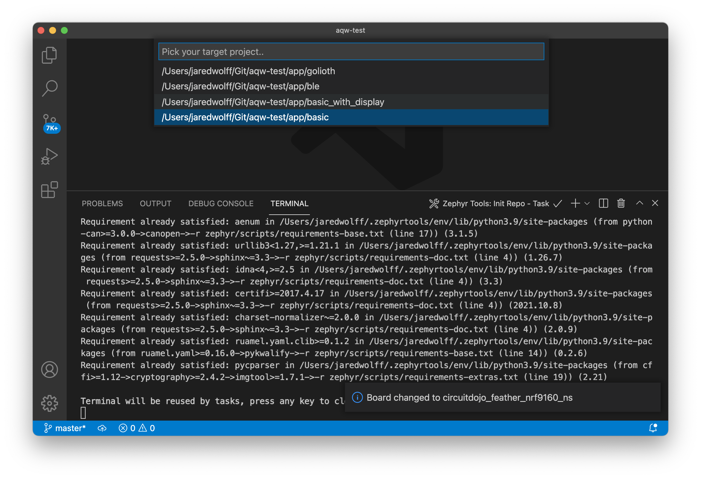

# SDK Setup (Linux - Ubuntu)

- [SDK Setup (Linux - Ubuntu)](#sdk-setup-linux---ubuntu)
  - [Installing IDE](#installing-ide)
  - [Installing Extension](#installing-extension)
    - [Install the Extension](#install-the-extension)
    - [Run Setup](#run-setup)
    - [Init the repo](#init-the-repo)
    - [Then build the sample!](#then-build-the-sample)
  - [`newtmgr` (Used to load your application via USB serial bootloader)](#newtmgr-used-to-load-your-application-via-usb-serial-bootloader)
  - [Testing it](#testing-it)

This page is all about getting your Linux machine compiling code for the nRF9160 Feather. Run into trouble during the process? Post your questions on the [community forum.](https://community.jaredwolff.com)

## Installing IDE
1. Install or use the code editor of your choice. I personally use Microsoft Visual Studio Code. You can download directly from the Ubuntu Software Install utility.
   

## Installing Extension

Fortunately, it's a bit easier to get started with the VSCode extension. The VSCode is required along with a Python 3 and Git on your system before continuing. 

First make sure you [download the extension here. 👈](https://marketplace.visualstudio.com/items?itemName=circuitdojo.zephyr-tools&ssr=false#overview)

Then install Git and Python.

For example on Ubuntu:

```
sudo apt install git python3 python3-pip
```

### Install the Extension



You can [download the extension here. 👈](https://marketplace.visualstudio.com/items?itemName=circuitdojo.zephyr-tools&ssr=false#overview)

Once loaded it will also install all necessary VSCode dependencies.

### Run Setup

Then open the command window (COMMAND+SHIFT+P on Mac or CTRL+SHIFT+P on other systems) and type `Zephyr Tools: Setup`



### Init the repo

Then initialize this repo using the `Zephyr Tools: Init Repo` command:



Make sure you use `https://github.com/circuitdojo/nrf9160-feather-examples-and-drivers.git` as the URL. It's best to select an **empty folder** to initialize the project to.

### Then build the sample!


You'll be prompted for a **project** and **board**. Make sure the board matches the supported boards. Current supported board targets include:

Here's what it will look like:




Once the build completes you should get a **Build complete!** popup along with some success messages in the the terminal.

## `newtmgr` (Used to load your application via USB serial bootloader)

`newtmgr` is automatically installed with your VSCode extension. Lets configure it the rest of the way.
   
1. Add your serial profile to make it easier to download/update your device:
   ```
   newtmgr conn add serial type=serial connstring='dev=/dev/ttyUSB0,baud=1000000'
   newtmgr -c serial reset
   ```

   If you have multiple Silicon Labs CP2102 connected to your machine your serial port *may be named differently*. I recommend you unplug all devices that could be named `ttyUSB0` to ensure you're targeting the correct device during programming.

   **Note** if you get a `Error: open /dev/ttyUSB0: permission denied` error. You'll have to fix permissions for the serial device for all users. Here are the steps:

   Open this `.rules` file in `vi` (or your editor of choice)

   ```
   sudo vi /etc/udev/rules.d/50-myusb.rules
   ```

   Then within the editor hit **i**, paste this:

   ```
   KERNEL=="ttyUSB[0-9]*",MODE="0666"
   KERNEL=="ttyACM[0-9]*",MODE="0666"
   ```

   Hit the **esc** button and then type `:wq!`.


For more info in using `newtmgr` checkout the [programming section](nrf9160-programming-and-debugging.md#booloader-use) of this documentation.

## Testing it

You can quickly test if your SDK is set up correctly by checking out the [samples](nrf9160-example-code.md).