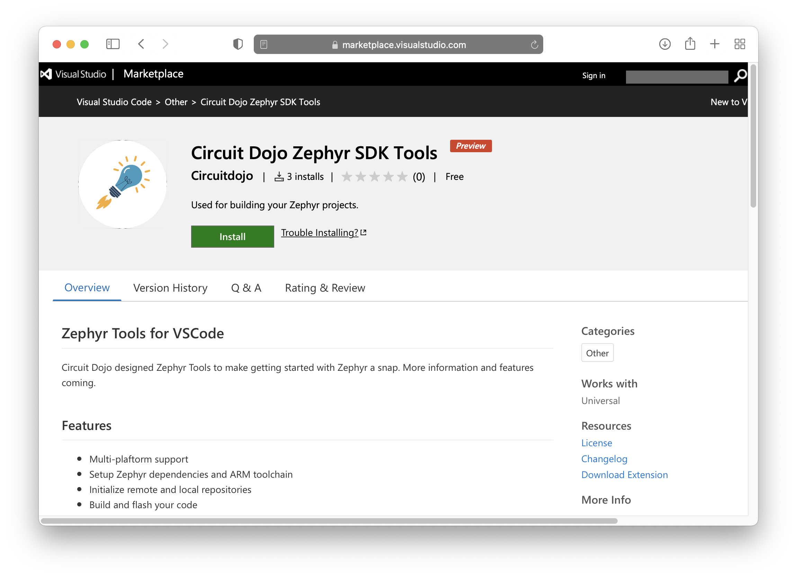
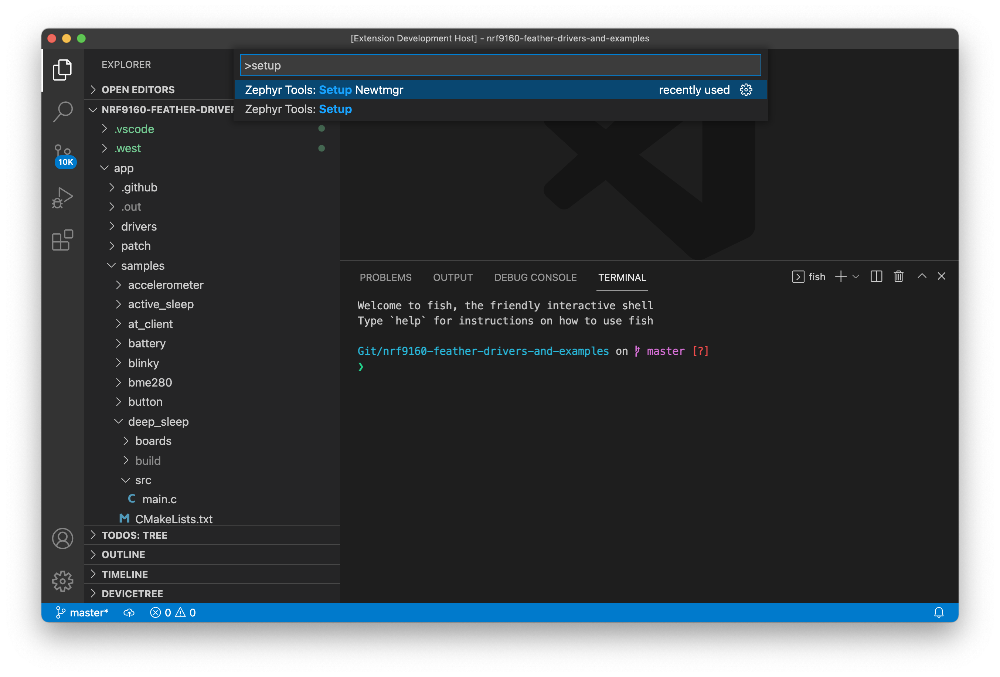
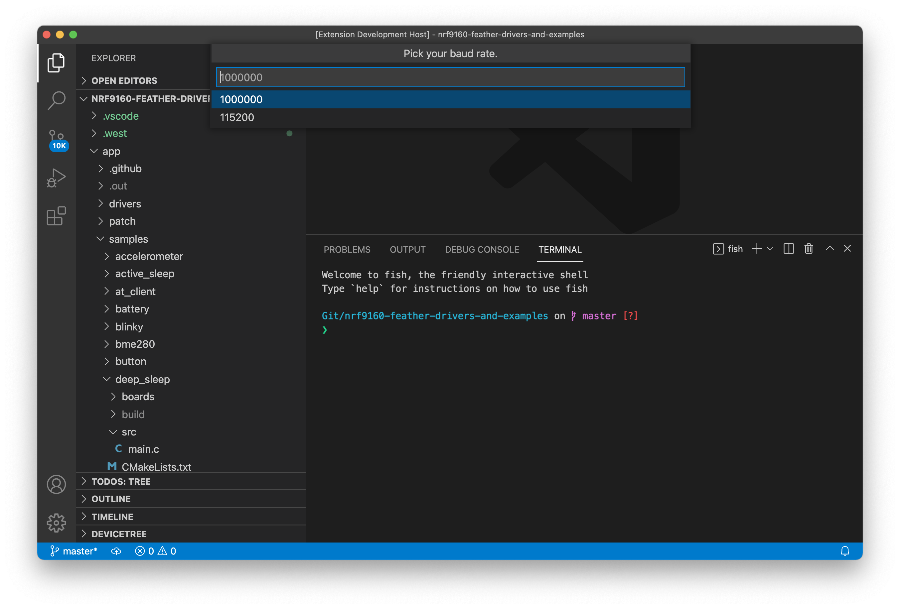

# SDK Setup (Linux - Ubuntu)

- [SDK Setup (Linux - Ubuntu)](#sdk-setup-linux---ubuntu)
  - [Installing Extension](#installing-extension)
    - [Run Setup](#run-setup)
    - [Init the repo](#init-the-repo)
    - [Then build the sample!](#then-build-the-sample)
  - [`newtmgr` (Used to load your application via USB serial bootloader)](#newtmgr-used-to-load-your-application-via-usb-serial-bootloader)
    - [Fixing serial port errors](#fixing-serial-port-errors)
  - [Testing it](#testing-it)

This page is all about getting your Linux machine compiling code for the nRF9160 Feather. Run into trouble during the process? Post your questions on the [community forum.](https://community.circuitdojo.com)

## Installing Extension

If you didn't already, install Visual Studio code. You can download directly from the Ubuntu Software Install utility. (or similar)


Then we can continue installing the extension!



Fortunately, it's a bit easier to get started with the VSCode extension. The VSCode is required along with a Python 3 and Git on your system before continuing.

Once Visual Studio code is installed, [download the extension here. 👈](https://marketplace.visualstudio.com/items?itemName=circuitdojo.zephyr-tools&ssr=false#overview)

Once loaded it will also install all necessary VSCode dependencies.

Then, install Git, Python, and Pip.

For example on Ubuntu:

```
sudo apt install git python3 python3-pip
```

### Run Setup

Then open the command window (COMMAND+SHIFT+P on Mac or CTRL+SHIFT+P on other systems) and type `Zephyr Tools: Setup`


### Init the repo

Then initialize this repo using the `Zephyr Tools: Init Repo` command:


Make sure you use `https://github.com/circuitdojo/nrf9160-feather-examples-and-drivers.git` as the URL. It's best to select an **empty folder** to initialize the project to.

### Then build the sample!


You'll be prompted for a **project** and **board**. Make sure the board matches the supported boards. Current supported board targets include:

Here's what it will look like:


Once the build completes you should get a **Build complete!** popup along with some success messages in the the terminal.

## `newtmgr` (Used to load your application via USB serial bootloader)

`newtmgr` is the command line utility for loading code to your device. It is automatically installed with the VSCode extension. Lets configure it the rest of the way.

Configuring is simple as running the **Zephyr Tools: Setup Newtmgr** command



Select your serial port:


Then select the BAUD. (**Important!** The nRF19160 Feather _only_ supports `1000000`) Once complete you're ready to run the **Zephyr Tools: Load via Bootloader** command.



### Fixing serial port errors

**Note** if you get a `Error: open /dev/ttyUSB0: permission denied` error. You may need to add your user to the `dialout` group:

```
sudo usermod -a -G dialout <username>
```

This allows you to open a serial port _without_ having to use `sudo`.

For more info in using `newtmgr` checkout the [programming section](nrf9160-programming-and-debugging.md#booloader-use) of this documentation.

## Testing it

You can quickly test if your SDK is set up correctly by checking out the [samples](nrf9160-example-code.md).
