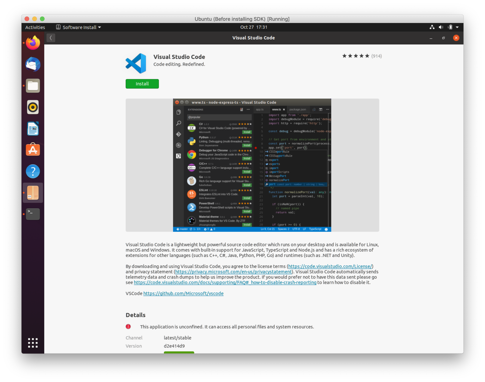

# SDK Setup (Linux - Ubuntu)


This page is all about getting your Linux machine compiling code for the nRF9160 Feather. Run into trouble during the process? Post your questions on the [community forum.](https://community.jaredwolff.com)

## Installing IDE
1. Install or use the code editor of your choice. I personally use Microsoft Visual Studio Code. You can download directly from the Ubuntu Software Install utility.
   
1. If you decide to use Visual Studio Code, make sure you install the **C/C++** and **Cortex-Debug** extentions using the built in extension marketplace.

## Installing SDK
1. Install dependencies using `apt-get`
   ```
   sudo apt install --no-install-recommends git cmake ninja-build gperf \
   ccache dfu-util device-tree-compiler wget \
   python3-dev python3-pip python3-setuptools python3-tk python3-wheel xz-utils file \
   make gcc gcc-multilib g++-multilib libsdl2-dev
   ```
1. Check your `cmake` version:
   ```
   cmake --version
   ```

   If it's older than 3.13.3, you'll have to install a newer version using the [instructions here.](https://developer.nordicsemi.com/nRF_Connect_SDK/doc/latest/zephyr/getting_started/index.html#install-required-tools)
1. Install `west`. West is the most important utility for using nRF Connect SDK & Zephyr. You'll become *quite* familliar with very soon.
   ```
   pip3 install --user -U west
   ```
1. Then make sure that `~/.local/bin` is added to your path:
   ```
   echo 'export PATH=~/.local/bin:"$PATH"' >> ~/.bashrc
   source ~/.bashrc
   ```
1. Now create a folder on your machine and call it `nfed` (short for nRF9160 Feather Examples and Drivers). Open a terminal to this folder and initialize nRF Connect SDK using `west`:
   ```
   cd ~
   mkdir nfed
   cd nfed
   west init -m https://github.com/circuitdojo/nrf9160-feather-examples-and-drivers --mr main
   ```

1. Once your nRF Connect SDK compontents are downloaded, you'll need to fetch the remaining SDK:
   ```
   west update
   ```
   You'll see a *bunch* of output go by as `west` downloads dependencies using Git.

   Here's what your `nfed` folder should look like:
   ```
   ❯ tree -L 1
   .
   ├── bootloader
   ├── build
   ├── latest
   ├── mbedtls
   ├── modules
   ├── nrf
   ├── nrf9160-feather
   ├── nrfxlib
   ├── test
   ├── tools
   └── zephyr
   ```
1. Installing the remaining SDK requirements using `pip3`:
   ```
   pip3 install --user -r zephyr/scripts/requirements.txt
   pip3 install --user -r nrf/scripts/requirements.txt
   pip3 install --user -r bootloader/mcuboot/scripts/requirements.txt
   ```

   **Note:** there may be an error during the first `pip3 install` you can safely ignore them.

## The ARM Embedded Toolchain

1. First download the latest Zephyr SDK installer:
   ```
   cd ~
   wget https://github.com/zephyrproject-rtos/sdk-ng/releases/download/v0.11.4/zephyr-sdk-0.11.4-setup.run
   ```
1. Then run it:
   ```
   chmod +x zephyr-sdk-0.11.4-setup.run
   ./zephyr-sdk-0.11.4-setup.run -- -d ~/zephyr-sdk-0.11.4
   ```
1. Finally install the udev rules which allows you to flash boards using a programmer.
   ```
   sudo cp ~/zephyr-sdk-0.11.4/sysroots/x86_64-pokysdk-linux/usr/share/openocd/contrib/60-openocd.rules /etc/udev/rules.d
   sudo udevadm control --reload
   ```

## `newtmgr`

1. For loading code to your nRF9160 Feather, you'll need to download and copy a custom version of `newtmgr` to a folder in your `PATH`.

   ```
   cd ~/Downloads
   wget "https://docs.jaredwolff.com/files/newtmgr/linux/newtmgr.zip"
   unzip newtmgr.zip
   mv newtmgr ~/.local/bin
   rm newtmgr.zip
   ```

   If you're not sure, `~/.local/bin` is always a good spot for these types of binaries.
1. Then you'll need to add your serial profile to make it easier to download/update your device:
   ```
   newtmgr conn add serial type=serial connstring='dev=/dev/ttyUSB0,baud=1000000'
   newtmgr -c serial reset
   ```

   If you have multiple Silicon Labs CP2102 connected to your machine your serial port *may be named differently*. I recommend you unplug all devices that could be named `ttyUSB0` to ensure you're targeting the correct device during programming.

   **Note** if you get a `Error: open /dev/ttyUSB0: permission denied` error. You'll have to fix permissions for the serial device for all users. Here are the steps:

   Open this `.rules` file in `vi` (or your editor of choice)

   ```
   sudo vi /etc/udev/rules.d/50-myusb.rules
   ```

   Then within the editor hit **i**, paste this:

   ```
   KERNEL=="ttyUSB[0-9]*",MODE="0666"
   KERNEL=="ttyACM[0-9]*",MODE="0666"
   ```

   Hit the **esc** button and then type `:wq!`.


For more info in using `newtmgr` checkout the [programming section](nrf9160-programming-and-debugging.md#booloader-use) of this documentation.

## Testing it

You can quickly test if your SDK is set up correctly by checking out the [`blinky` example](nrf9160-blinky-sample.md).