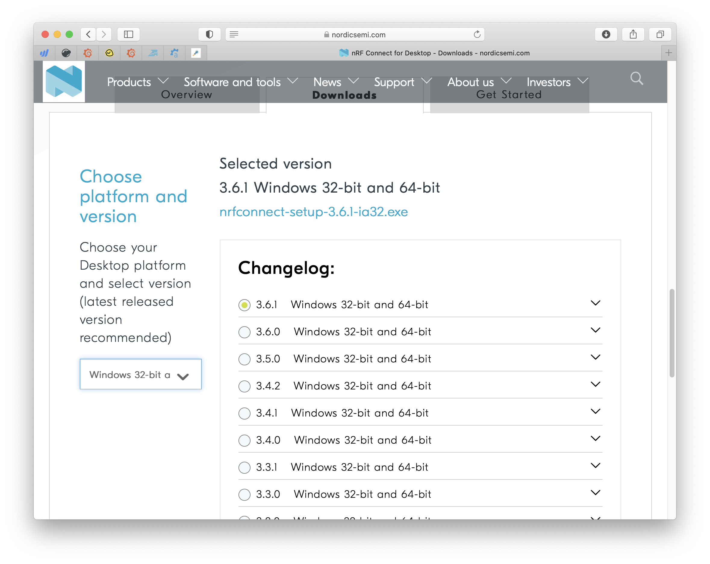
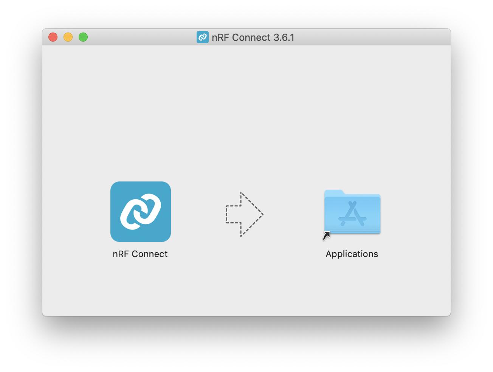
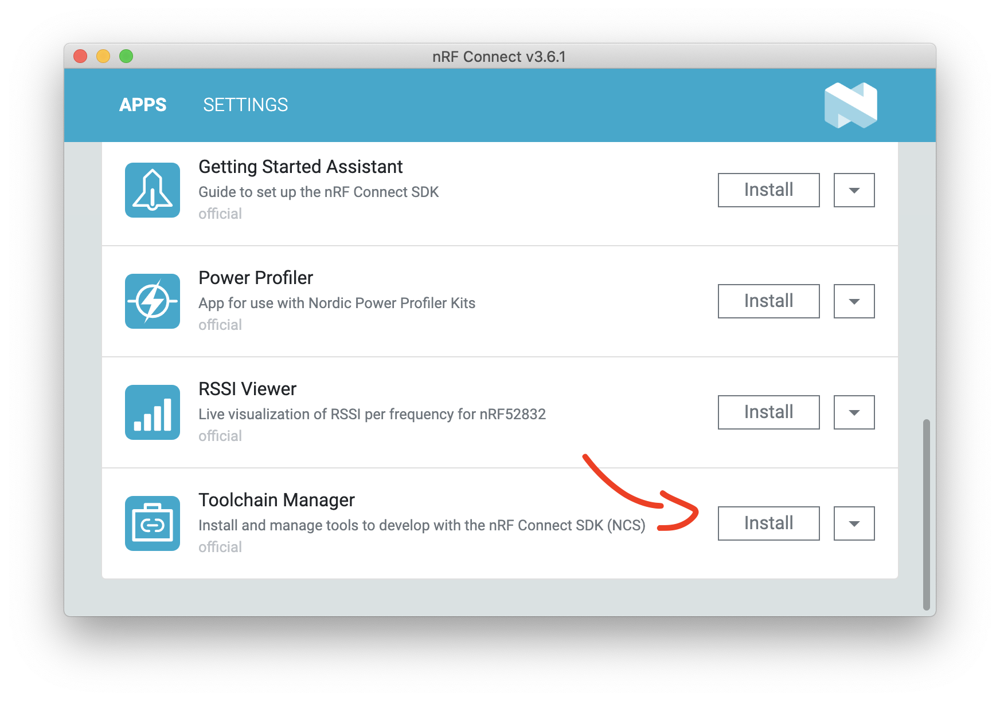
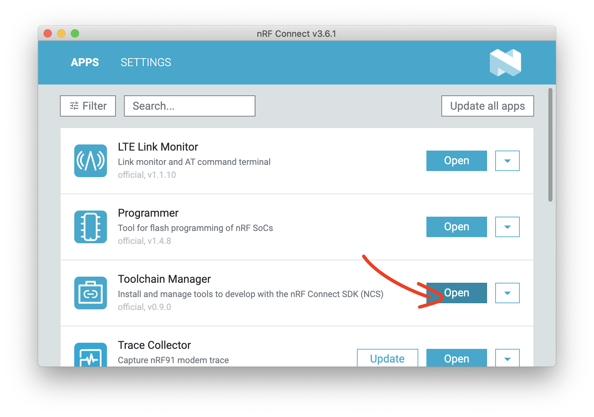
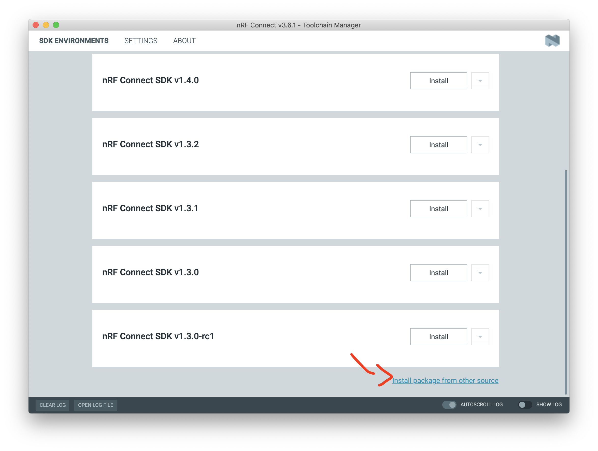
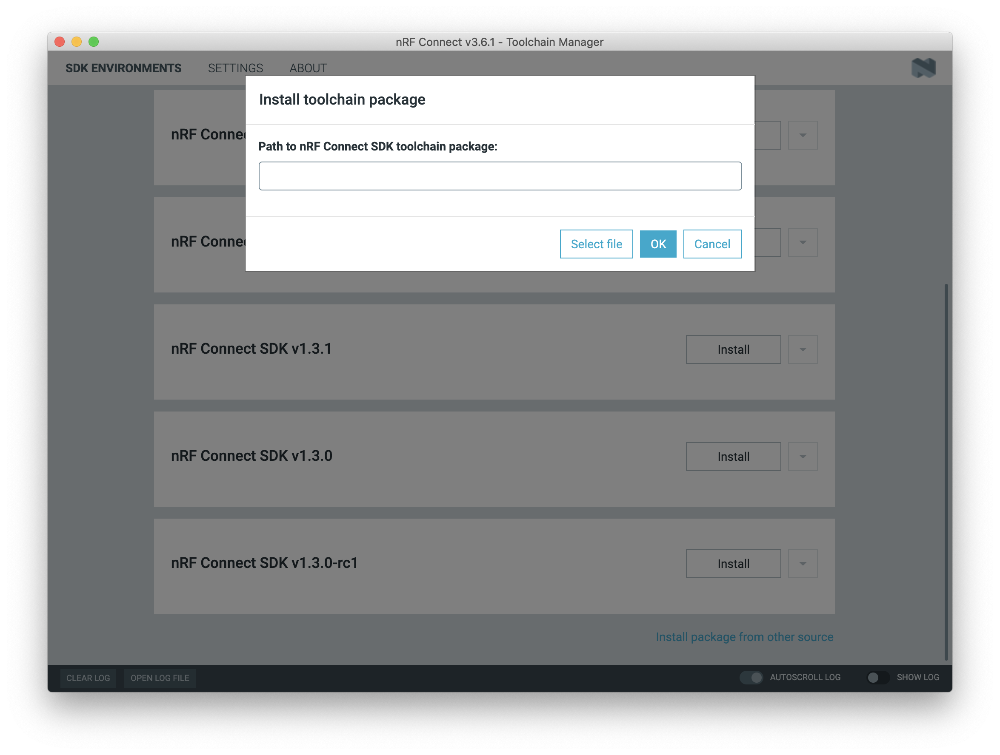
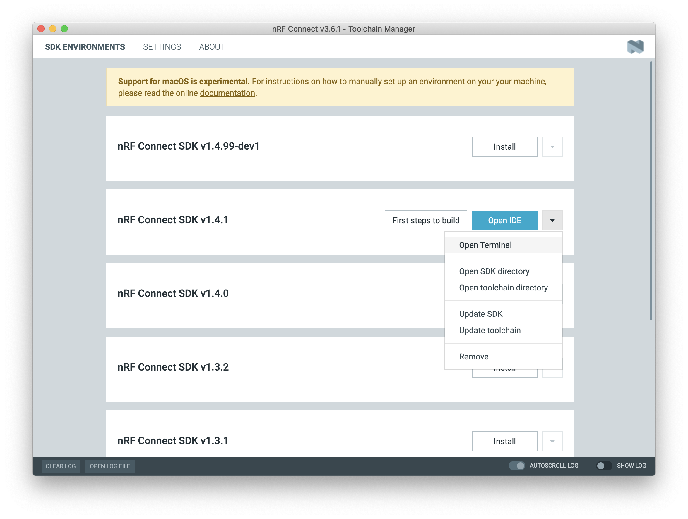

# SDK Setup (Mac OS)

This page is all about getting your Mac compiling code for the nRF9160 Feather. Run into trouble during the process? Post your questions on the [community forum.](https://community.jaredwolff.com)

## Installing IDE
1. Install or use the code editor of your choice. I personally use Microsoft Visual Studio Code. The download link is [here](https://code.visualstudio.com/docs/?dv=osx)
1. If you decide to use Visual Studio Code, make sure you install the **C/C++** and **Cortex-Debug** extentions using the built in extension marketplace.

## Installing SDK

Before we start, if you already have NCS installed, you can skip to **Step 8**. Let's begin!

Installing the latest SDK is a snap and only takes a few steps. Let's walk through them here:

1. Download and install [nRF Connect For Desktop](https://www.nordicsemi.com/Software-and-tools/Development-Tools/nRF-Connect-for-desktop/Download#infotabs)
   
   

2. Copy the app to your Applications folder

   

3. Open up the app and install the Toolchain Manager

   

4. Then open it up.

   

5. Scroll to the bottom and click **Install package from other source**

   

6. Then paste this url into the box and click **ok**.

   ```
   http://developer.nordicsemi.com/.pc-tools/toolchain/ncs-toolchain-v1.4.1-20201215-7ecf886-minimal.dmg
   ```

   

7. The download and install will take a few minutes. Hang out, take a walk, sing a song and come back later.
8. Finally, once installed you'll have a dropdown that you can access. Click on it and then the **Open Terminal** option.
   

9. To get the nRF9160 Feather examples we'll update `/opt/nordic/v1.4.1/nrf/west.yml`. First in the `remotes` section add:

   ```yaml
    - name: circuitdojo
      url-base: https://github.com/circuitdojo
   ```

   So it looks like:

   ```yaml
    - name: Alexa-Gadgets-Embedded-Sample-Code
      path: modules/alexa-embedded
      revision: face92d8c62184832793f518bb1f19379538c5c1
      remote: alexa
    - name: nfed
      repo-path: nrf9160-feather-examples-and-drivers
      revision: v1.4.x
      path: nfed
      remote: circuitdojo
   ```

10. Then in the `projects` section add at the bottom:

    ```yaml
    - name: nfed
      repo-path: nrf9160-feather-examples-and-drivers
      revision: v1.4.x
      path: nfed
      remote: circuitdojo
    ```

    So it looks like:

    ```yaml
    ...
    - name: Alexa-Gadgets-Embedded-Sample-Code
      path: modules/alexa-embedded
      revision: face92d8c62184832793f518bb1f19379538c5c1
      remote: alexa
    - name: nfed
      repo-path: nrf9160-feather-examples-and-drivers
      revision: v1.4.x
      path: nfed
      remote: circuitdojo
    ```
    
11. Then run `west update` in your freshly created terminal session. This will fetch the nRF9160 Feather examples.

## Installing `newtmgr`

1. For loading code to your nRF9160 Feather, you'll need to download and copy a custom version of `newtmgr`. Open a terminal window and run:

   ```
   cd ~/Downloads
   wget "https://docs.jaredwolff.com/files/newtmgr/darwin/newtmgr.zip"
   unzip newtmgr.zip
   mv newtmgr /opt/nordic/ncs/v1.4.1/toolchain/bin
   rm newtmgr.zip
   ```

2. Then you'll need to add your serial profile to make it easier to download/update your device:
   ```
   newtmgr conn add serial type=serial connstring='dev=/dev/tty.SLAB_USBtoUART,baud=1000000'
   ```
   If you have multiple Silicon Labs CP2102 connected to your machine your serial port *may be named differently*. I recommend you unplug all devices that could be named `tty.SLAB_USBtoUART` to ensure you're targeting the correct device during programming.
3. **Having trouble?** You may have to [install the drivers.](https://www.silabs.com/products/development-tools/software/usb-to-uart-bridge-vcp-drivers)

For more info in using `newtmgr` checkout the [programming section](nrf9160-programming-and-debugging.md#booloader-use) of this documentation.

## Migrating from previous instructions

Follow the same steps as above. Except for **Step 9**.  Then copy your `nfed` directory from your old setup to the new SDK folder. It will be in `/opt/nordic/ncs/v1.4.1/`. You'll want to checkout the latest using `git pull && git checkout v1.4.1`. 

## Testing it

Now you can get to playing around with some of the nRF9160 Feather example code! Remember you'll always have to open a terminal using the Toolchain Manager to build code!

You can quickly test if your SDK is set up correctly by checking out the [`blinky` example](nrf9160-blinky-sample.md).