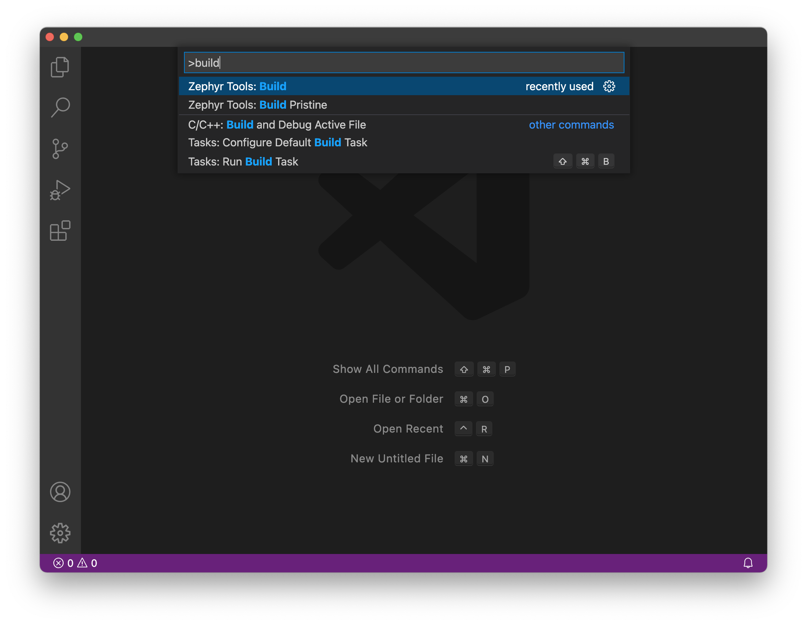

# SDK Setup (Mac OS)

- [SDK Setup (Mac OS)](#sdk-setup-mac-os)
  - [Installing IDE](#installing-ide)
  - [Installing Extension](#installing-extension)
    - [Install the Extension](#install-the-extension)
    - [Run Setup](#run-setup)
    - [Init the repo](#init-the-repo)
    - [Then build the sample!](#then-build-the-sample)
  - [Installing `newtmgr` (Used to load your application via USB serial bootloader)](#installing-newtmgr-used-to-load-your-application-via-usb-serial-bootloader)
  - [Testing it](#testing-it)

This page is all about getting your Mac compiling code for the nRF9160 Feather. Run into trouble during the process? Post your questions on the [community forum.](https://community.jaredwolff.com)

## Installing IDE
1. Install or use the code editor of your choice. I personally use Microsoft Visual Studio Code. The download link is [here](https://code.visualstudio.com/docs/?dv=osx)
1. If you decide to use Visual Studio Code, make sure you install the **C/C++** and **Cortex-Debug** extentions using the built in extension marketplace.

## Installing Extension

Fortunately, it's a bit easier to get started with the VSCode extension. The VSCode is required along with a Python 3 and Git on your system before continuing. 

First make sure you [download the extension here. 👈](https://marketplace.visualstudio.com/items?itemName=circuitdojo.zephyr-tools&ssr=false#overview)

The easiest way to install `git` and `python3` is with [Homebrew](https://brew.sh).

```
> brew install git python3
```

### Install the Extension


You can [download the extension here. 👈](https://marketplace.visualstudio.com/items?itemName=circuitdojo.zephyr-tools&ssr=false#overview)

### Run Setup

Then open the command window (COMMAND+SHIFT+P on Mac or CTRL+SHIFT+P on other systems) and type `Zephyr Tools: Setup`


### Init the repo

Then initialize this repo using the `Zephyr Tools: Init Repo` command:


Make sure you use `https://github.com/circuitdojo/nrf9160-feather-examples-and-drivers.git` as the URL. It's best to select an **empty folder** to initialize the project to.

### Then build the sample!



You'll be prompted for a **project** and **board**. Make sure the board matches the supported boards. Current supported board targets include:

Here's what it will look like:


Once the build completes you should get a **Build complete!** popup along with some success messages in the the terminal.

## Installing `newtmgr` (Used to load your application via USB serial bootloader)

`newtmgr` is automatically installed with your VSCode extension. Lets configure it the rest of the way.

1. If you'r on a newer version of OSX you'll need to [install the drivers.](https://www.silabs.com/products/development-tools/software/usb-to-uart-bridge-vcp-drivers)

1. Then you'll need to add your serial profile to make it easier to download/update your device:
   ```
   newtmgr conn add serial type=serial connstring='dev=/dev/tty.SLAB_USBtoUART,baud=1000000'
   ```
   If you have multiple Silicon Labs CP2102 connected to your machine your serial port *may be named differently*. I recommend you unplug all devices that could be named `tty.SLAB_USBtoUART` to ensure you're targeting the correct device during programming.

For more info in using `newtmgr` checkout the [programming section](nrf9160-programming-and-debugging.md#booloader-use) of this documentation.

## Testing it

Now you can get to playing around with some of the nRF9160 Feather example code! Remember you'll always have to open a terminal using the Toolchain Manager to build code!

You can quickly test if your SDK is set up correctly by checking out the [samples](nrf9160-example-code.md).