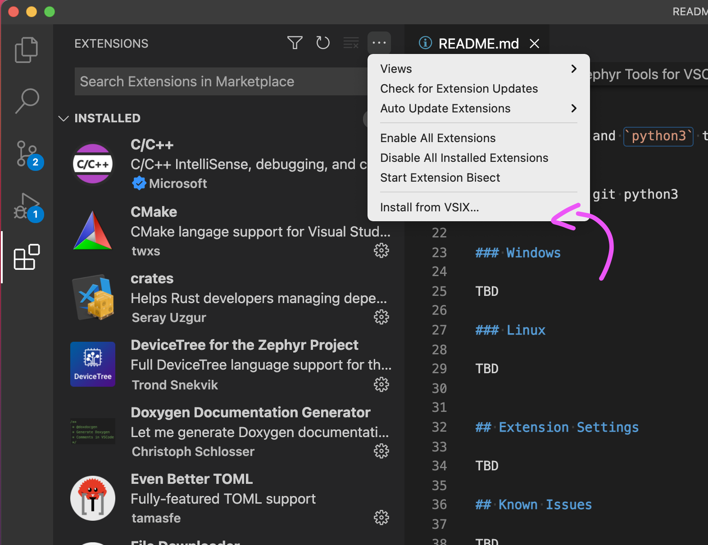

# SDK Setup (Windows)

- [SDK Setup (Windows)](#sdk-setup-windows)
  - [IDE Setup](#ide-setup)
  - [Installing Extension](#installing-extension)
    - [Install the Extension](#install-the-extension)
    - [Run Setup](#run-setup)
    - [Init the repo](#init-the-repo)
    - [Then build the sample!](#then-build-the-sample)
  - [`newtmgr` (Used to load your application via USB serial bootloader)](#newtmgr-used-to-load-your-application-via-usb-serial-bootloader)
  - [Testing it](#testing-it)

This page is all about getting your Windows machine compiling code for the nRF9160 Feather. Run into trouble during the process? Post your questions on the [community forum.](https://community.jaredwolff.com)

## IDE Setup

1. Install or use the code editor of your choice. I personally use Microsoft Visual Studio Code. The download link is [here](https://code.visualstudio.com/docs/?dv=win64user)
1. If you decide to use Visual Studio Code, make sure you install the **C/C++** and **Cortex-Debug** extentions using the built in extension marketplace.
   

## Installing Extension


You can [download the extension here. 👈](https://marketplace.visualstudio.com/items?itemName=circuitdojo.zephyr-tools&ssr=false#overview)

Then install `git` and `python` if you don't have them already:

- Download and install `git` [from here.](https://git-scm.com/download/win)
- Download and install `python` [from here.](https://www.python.org/ftp/python/3.9.9/python-3.9.9-amd64.exe)

### Install the Extension

Open VSCode and go to the extensions tab. Use the dropdown to install .visx manually.



Once loaded it will also install all necessary VSCode dependencies.

### Run Setup

Then open the command window (COMMAND+SHIFT+P on Mac or CTRL+SHIFT+P on other systems) and type `Zephyr Tools: Setup`


### Init the repo

Then initialize this repo using the `Zephyr Tools: Init Repo` command:


Make sure you use `https://github.com/circuitdojo/nrf9160-feather-examples-and-drivers.git` as the URL. It's best to select an **empty folder** to initialize the project to.

### Then build the sample!


You'll be prompted for a **project** and **board**. Make sure the board matches the supported boards. Current supported board targets include:

Here's what it will look like:


Once the build completes you should get a **Build complete!** popup along with some success messages in the the terminal.


## `newtmgr` (Used to load your application via USB serial bootloader)

`newtmgr` is automatically installed with your VSCode extension. Lets configure it the rest of the way.

1. Then, you'll need to add your serial profile to make it easier to download/update your device:
   ```
   newtmgr conn add serial type=serial connstring="dev=COM5,baud=1000000"
   ```
   Make sure that the COM port matches the one attached to the nRF9160 Feather. An easy way to check is to remove and add the device to see which COM port shows up in device manager.
4. **Having trouble?** You may need to install the [Silabs VCP driver.](https://www.silabs.com/developers/usb-to-uart-bridge-vcp-drivers). Download and install the **CP210x VCP Windows** option.

For more info in using `newtmgr` checkout the [programming section](nrf9160-programming-and-debugging.md#booloader-use) of this documentation.


## Testing it

You can quickly test if your SDK is set up correctly by checking out the [samples](nrf9160-example-code.md). Make sure that you've closed and re-opened all terminals and Visual Studio Code so the environment is correct. Otherwise you may have issues compiling or flashing code.
