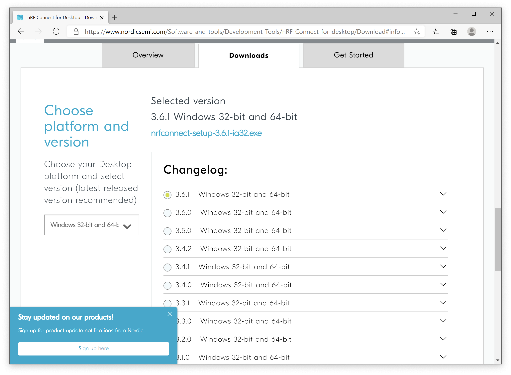
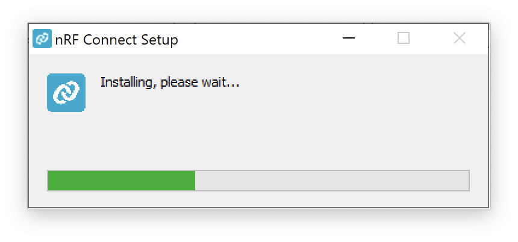
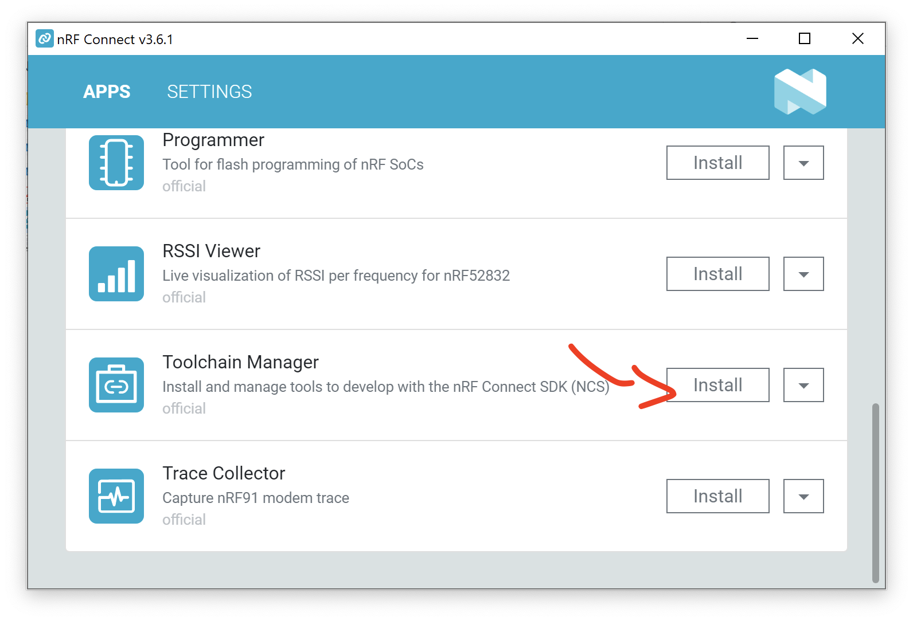
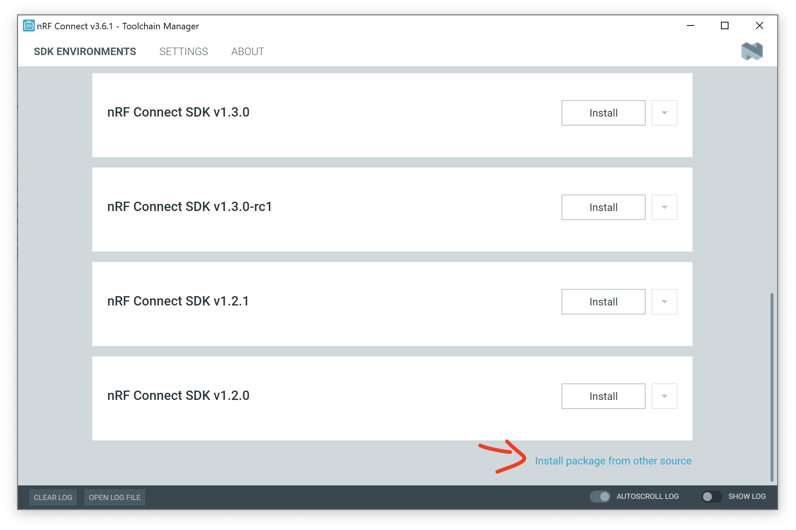
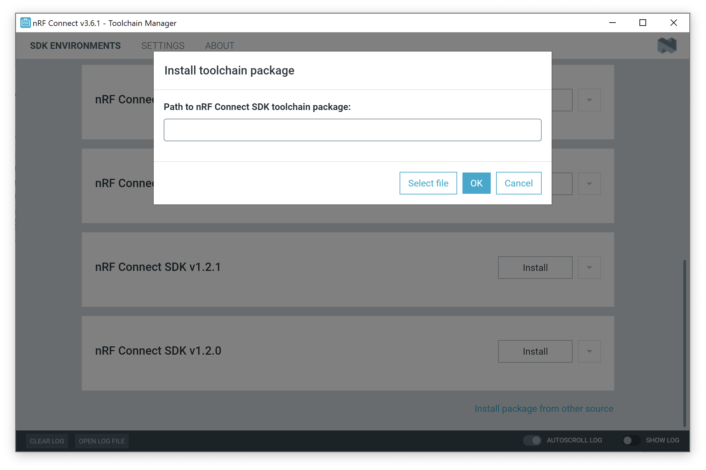
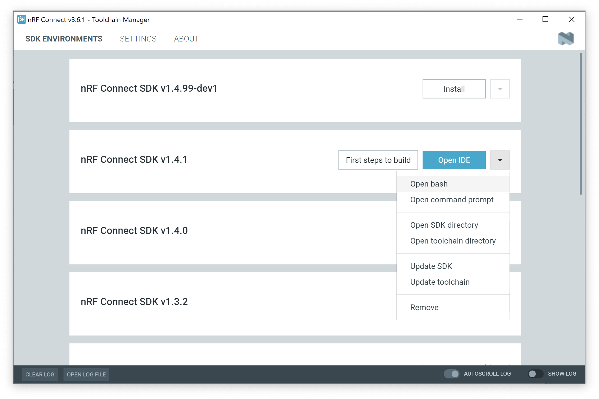

# SDK Setup (Windows)

This page is all about getting your Windows machine compiling code for the nRF9160 Feather. Run into trouble during the process? Post your questions on the [community forum.](https://community.jaredwolff.com)

## IDE Setup

1. Install or use the code editor of your choice. I personally use Microsoft Visual Studio Code. The download link is [here](https://code.visualstudio.com/docs/?dv=win64user)
1. If you decide to use Visual Studio Code, make sure you install the **C/C++** and **Cortex-Debug** extentions using the built in extension marketplace.
   

## SDK Install

Before we start, if you already have NCS installed, you can skip to **Step 8**. Let's begin!

1. Download and install [nRF Connect For Desktop](https://www.nordicsemi.com/Software-and-tools/Development-Tools/nRF-Connect-for-desktop/Download#infotabs)
   
   

2. Once downloaded, run the installer.

   

3. Open up the app and install the Toolchain Manager

   

4. Then open it up after installing.

5. Scroll to the bottom and click **Install package from other source**

   

6. Then paste this url into the box and click **ok**.

   ```
   http://developer.nordicsemi.com/.pc-tools/toolchain/ncs-toolchain-v1.5.0-20210225-607a0e0-minimal.zip
   ```

   

7. The download and install will take a few minutes. Hang out, take a walk, sing a song and come back later.
8. Finally, once installed you'll have a dropdown that youc an access. Click on it and then the **Open Bash** or **Open Command Prompt** option. (I prefer bash since I use *nix a lot)
   

9. To get the nRF9160 Feather examples we'll update `C:\Users\<your username>\ncs\v1.5.0\nrf\west.yml`. First in the `remotes` section add:

   ```yaml
    - name: circuitdojo
      url-base: https://github.com/circuitdojo
   ```

10. Then in the `projects` section add at the bottom:

    ```yaml
    - name: nfed
      repo-path: nrf9160-feather-examples-and-drivers
      revision: v1.5.x
      path: nfed
      remote: circuitdojo
    ```
    
    Here's the diff for the file afterwards:

    ```
    diff --git a/west.yml b/west.yml
    index 2065ad3f..de8ea812 100644
    --- a/west.yml
    +++ b/west.yml
    @@ -33,6 +33,8 @@ manifest:
           url-base: https://github.com/nanopb
         - name: alexa
           url-base: https://github.com/alexa
    +    - name: circuitdojo
    +      url-base: https://github.com/circuitdojo
     
       # If not otherwise specified, the projects below should be obtained
       # from the ncs remote.
    @@ -124,6 +126,13 @@ manifest:
           path: modules/alexa-embedded
           revision: face92d8c62184832793f518bb1f19379538c5c1
           remote: alexa
    +    - name: nfed
    +      repo-path: nrf9160-feather-examples-and-drivers
    +      revision: v1.5.x
    +      path: nfed
    +      remote: circuitdojo
    +    - name: pyrinas
    +      path: pyrinas
     
       # West-related configuration for the nrf repository.
       self:
    
11. Then run `west update` in your freshly created bash/command prompt session. This will fetch the nRF9160 Feather examples.


## `newtmgr`

1. For loading code to your nRF9160 Feather, you'll need to download and copy a custom version of `newtmgr`.
   - [Windows](files/newtmgr/windows/newtmgr.zip)
1. Extract it and move it into your `toolchain/bin/` directory. This will likely be: `C:\Users\<your username>\ncs\v1.5.0\toolchain\bin`
2. Then, you'll need to add your serial profile to make it easier to download/update your device:
   ```
   newtmgr conn add serial type=serial connstring="dev=COM5,baud=1000000"
   ```
   Make sure that the COM port matches the one attached to the nRF9160 Feather. An easy way to check is to remove and add the device to see which COM port shows up in device manager.
3. **Having trouble?** You may need to install the [Silabs VCP driver.](https://www.silabs.com/developers/usb-to-uart-bridge-vcp-drivers). Download and install the **CP210x VCP Windows** option.

For more info in using `newtmgr` checkout the [programming section](nrf9160-programming-and-debugging.md#booloader-use) of this documentation.

## Migrating from previous instructions

Follow the same steps as above. Except for **Step 9**.  Then copy your `nfed` directory from your old setup to the new SDK folder. It will be in `/opt/nordic/ncs/v1.5.0/`. You'll want to checkout the latest using `git pull && git checkout v1.5.x`. 

## Testing it

You can quickly test if your SDK is set up correctly by checking out the [`blinky` example](nrf9160-blinky-sample.md). Make sure that you've closed and re-opened all terminals and Visual Studio Code so the environment is correct. Otherwise you may have issues compiling or flashing code.
