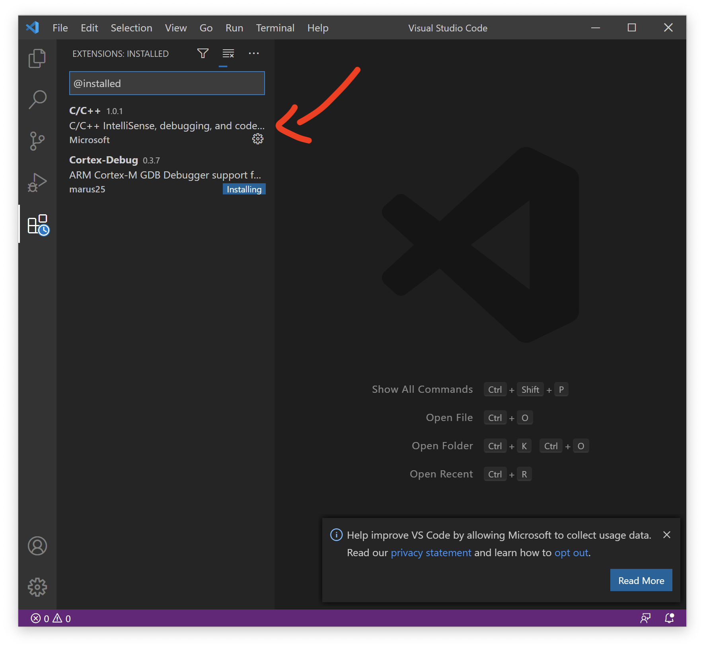
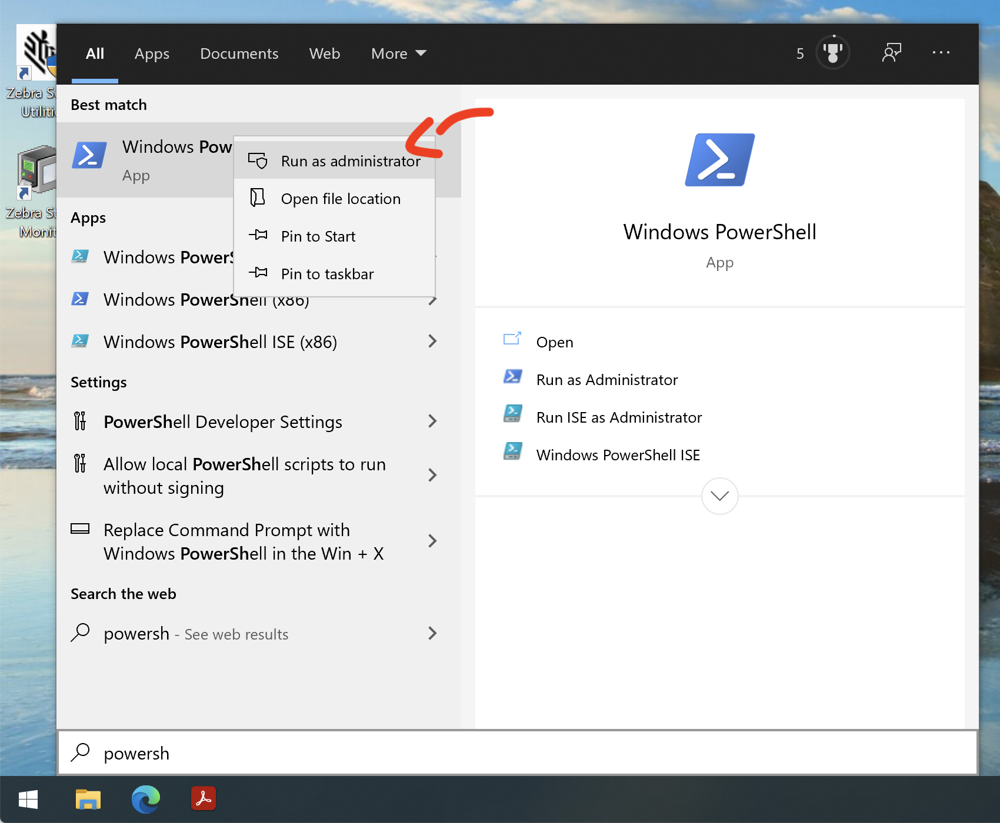
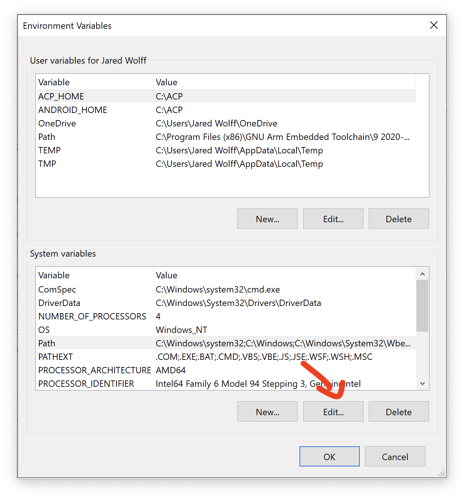

# SDK Setup (Windows)

This page is all about getting your Windows machine compiling code for the nRF9160 Feather. Run into trouble during the process? Post your questions on the [community forum.](https://community.jaredwolff.com)

## IDE Setup

1. Install or use the code editor of your choice. I personally use Microsoft Visual Studio Code. The download link is [here](https://code.visualstudio.com/docs/?dv=win64user)
1. If you decide to use Visual Studio Code, make sure you install the **C/C++** and **Cortex-Debug** extentions using the built in extension marketplace.
   

## SDK Install

1. Install the Chocolatey (`choco`) package manager. In the start menu type `Powershell` then right click and open with Administrative Privledges.

   

1. Then paste the install script and press enter:
   ```
   Set-ExecutionPolicy Bypass -Scope Process -Force; [System.Net.ServicePointManager]::SecurityProtocol = [System.Net.ServicePointManager]::SecurityProtocol -bor 3072; iex ((New-Object System.Net.WebClient).DownloadString('https://chocolatey.org/install.ps1'))
   ```

   For more info check out [this page](https://chocolatey.org/install).
1. Now, lets install the remaining deps we'll need for Zephyr/nRF Connect using `choco`. In the same `powershell.exe`as above run:

   ```
   choco feature enable -n allowGlobalConfirmation
   choco install cmake --installargs 'ADD_CMAKE_TO_PATH=System'
   choco install ninja gperf python git
   ```
1. Next install `west` using `pip`. West is the most important utility for using nRF Connect SDK & Zephyr. You'll become *quite* familliar with very soon.
   ```
   pip install west
   ```
   **💡Note:** you can update `west` by issuing `pip3 install -U west` It will uninstall the version on your machine and replace it with the latest. (It won't do anything if you have the latest installed.)
1. Now create a folder on your machine and call it `nfed` (short for nRF9160 Feather Examples and Drivers). For windows it's best to put it in `C:\`.
   Open a **new** command prompt (or powershell) in this folder and initialize nRF Connect SDK using `west`:

   ```
   cd C:\
   mkdir nfed
   cd nfed
   west init -m https://github.com/circuitdojo/nrf9160-feather-examples-and-drivers --mr main
   ```

   **Note:** if you are using an `ncs` directory structure (older documentation) you can do this with the same effect:

   ```
   cd ncs
   git clone https://github.com/circuitdojo/nrf9160-feather-examples-and-drivers nrf9160-feather
   ```

1. Once your nRF Connect SDK compontents are downloaded, you'll need to fetch the remaining SDK:
   ```
   west update
   ```
   You'll see a *bunch* of output go by as `west` downloads dependencies using Git. (This will take hot minute so make sure you're prepared with something else to do. 😬)

   Here's what your `nfed` folder should look like:
   ```
   C:\nfed>dir
    Volume in drive C has no label.
    Volume Serial Number is B013-63F8

    Directory of C:\nfed

   10/27/2020  12:25 PM    <DIR>          .
   10/27/2020  12:25 PM    <DIR>          ..
   10/27/2020  12:22 PM    <DIR>          .west
   10/27/2020  12:24 PM    <DIR>          bootloader
   10/27/2020  12:25 PM    <DIR>          mbedtls
   10/27/2020  12:27 PM    <DIR>          modules
   10/27/2020  12:22 PM    <DIR>          nrf
   10/27/2020  12:22 PM    <DIR>          nr9160-feather
   10/27/2020  12:24 PM    <DIR>          nrfxlib
   10/27/2020  12:24 PM    <DIR>          test
   10/27/2020  12:26 PM    <DIR>          tools
   10/27/2020  12:24 PM    <DIR>          zephyr
                  0 File(s)              0 bytes
                 11 Dir(s)  29,099,958,272 bytes free
   ```
1. Installing the remaining SDK requirements using `pip3`:
   ```
   pip install -r zephyr/scripts/requirements.txt
   pip install -r nrf/scripts/requirements.txt
   pip install -r bootloader/mcuboot/scripts/requirements.txt
   ```

   **Note** you will get an error during this process related to Visual Studio (not Visual Studio Code). You can ignore this issue.

## The ARM Embedded Toolchain

1. You can download and install the toolchain with [this direct link.](https://developer.arm.com/tools-and-software/open-source-software/developer-tools/gnu-toolchain/gnu-rm/downloads/9-2019-q4-major)

1. One installed, re-open your prompt (or use the provided DOS prompt that will pop up post install) and run `arm-none-eabi-gcc --version` to make sure it's installed correctly.
   ```
   arm-none-eabi-gcc --version
   arm-none-eabi-gcc (GNU Arm Embedded Toolchain 9-2019-q4-major) 9.2.1 20191025 (release)
   Copyright (C) 2019 Free Software Foundation, Inc.
   This is free software; see the source for copying conditions.  There is NO
   warranty; not even for MERCHANTABILITY or FITNESS FOR A PARTICULAR PURPOSE.
   ```
1. You will have to set some important environment variables. Here's what they should look like:
   ```
   setx ZEPHYR_TOOLCHAIN_VARIANT gnuarmemb
   setx GNUARMEMB_TOOLCHAIN_PATH "C:\Program Files (x86)\GNU Tools Arm Embedded\9 2019-q4-major"
   ```

## `newtmgr`

1. For loading code to your nRF9160 Feather, you'll need to download and copy a custom version of `newtmgr` to a folder in your `PATH`.
   - [Windows](files/newtmgr/windows/newtmgr.zip)

    If you're not sure, `C:\bin\` is always a good spot for these types of binaries.
1. You'll have to make sure that `C:\bin\` is added to your system `PATH`. Hit the start menu or Windows key and type "environment variables". Open the "Edit the system environment variables." option.
1. Go to the **System variables** section and find path.
1. Click **Edit**
   
1. Click **New**
1. Enter **C:\bin\\** into the new line.
1. Press **Ok** for the remaining prompts.
1. Then, you'll need to add your serial profile to make it easier to download/update your device:
   ```
   newtmgr conn add serial type=serial connstring="dev=COM5,baud=1000000"
   ```
   Make sure that the COM port matches the one attached to the nRF9160 Feather. An easy way to check is to remove and add the device to see which COM port shows up in device manager.

For more info in using `newtmgr` checkout the [programming section](nrf9160-programming-and-debugging.md#booloader-use) of this documentation.

## Testing it

You can quickly test if your SDK is set up correctly by checking out the [`blinky` example](nrf9160-blinky-sample.md). Make sure that you've closed and re-opened all terminals and Visual Studio Code so the environment is correct. Otherwise you may have issues compiling or flashing code.
