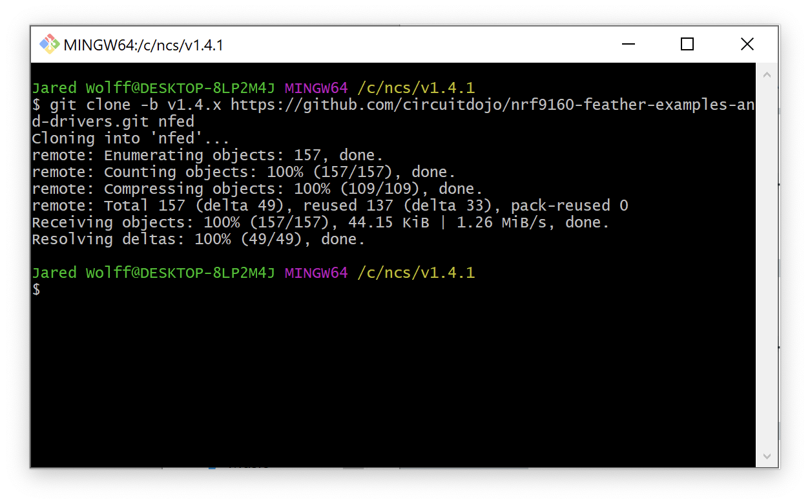

# SDK Setup (Windows)

This page is all about getting your Windows machine compiling code for the nRF9160 Feather. Run into trouble during the process? Post your questions on the [community forum.](https://community.jaredwolff.com)

## IDE Setup

1. Install or use the code editor of your choice. I personally use Microsoft Visual Studio Code. The download link is [here](https://code.visualstudio.com/docs/?dv=win64user)
1. If you decide to use Visual Studio Code, make sure you install the **C/C++** and **Cortex-Debug** extentions using the built in extension marketplace.
   

## `newtmgr`

1. For loading code to your nRF9160 Feather, you'll need to download and copy a custom version of `newtmgr` to a folder in your `PATH`.
   - [Windows](files/newtmgr/windows/newtmgr.zip)

    If you're not sure, `C:\bin\` is always a good spot for these types of binaries.
1. You'll have to make sure that `C:\bin\` is added to your system `PATH`. Hit the start menu or Windows key and type "environment variables". Open the "Edit the system environment variables." option.
1. Go to the **System variables** section and find path.
1. Click **Edit**
   
1. Click **New**
1. Enter **C:\bin\\** into the new line.
1. Press **Ok** for the remaining prompts.
1. Then, you'll need to add your serial profile to make it easier to download/update your device:
   ```
   newtmgr conn add serial type=serial connstring="dev=COM5,baud=1000000"
   ```
   Make sure that the COM port matches the one attached to the nRF9160 Feather. An easy way to check is to remove and add the device to see which COM port shows up in device manager.
1. **Having trouble?** You may need to install the [Silabs VCP driver.](https://www.silabs.com/developers/usb-to-uart-bridge-vcp-drivers). Download and install the **CP210x VCP Windows** option.

For more info in using `newtmgr` checkout the [programming section](nrf9160-programming-and-debugging.md#booloader-use) of this documentation.

## SDK Install

Before we start, if you already have NCS installed, you can skip to **Step 8**. Let's begin!

1. Download and install [nRF Connect For Desktop](https://www.nordicsemi.com/Software-and-tools/Development-Tools/nRF-Connect-for-desktop/Download#infotabs)
   
   

2. Once downloaded, run the installer.

   

3. Open up the app and install the Toolchain Manager

   

4. Then open it up after installing.

5. Scroll to the bottom and click **Install package from other source**

   

6. Then paste this url into the box and click **ok**.

   ```
   http://developer.nordicsemi.com/.pc-tools/toolchain/ncs-toolchain-v1.4.1-20201215-7ecf886-minimal.zip
   ```

   

7. The download and install will take a few minutes. Hang out, take a walk, sing a song and come back later.
8. Finally, once installed you'll have a dropdown that youc an access. Click on it and then the **Open Bash** or **Open Command Prompt** option. (I prefer bash since I use *nix a lot)
   

9.  This will open a terminal. Copy and paste this command into your new terminal to get all the nRF9160 Feather goodies!

   ```
   git clone -b v1.4.x https://github.com/circuitdojo/nrf9160-feather-examples-and-drivers.git nfed
   ```

   

Now you can get to playing around with some of the nRF9160 Feather example code! Remember you'll always have to open a terminal using the Toolchain Manager to build code!

## Migrating from previous instructions

Follow the same steps as above. Except for **Step 9**.  Then copy your `nfed` directory from your old setup to the new SDK folder. It will be in `/opt/nordic/ncs/v1.4.1/`. You'll want to checkout the latest using `git pull && git checkout v1.4.1`. 

## Testing it

You can quickly test if your SDK is set up correctly by checking out the [`blinky` example](nrf9160-blinky-sample.md). Make sure that you've closed and re-opened all terminals and Visual Studio Code so the environment is correct. Otherwise you may have issues compiling or flashing code.
