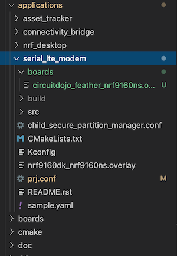

# Serial LTE Modem

The Serial LTE Modem sample is extremely handy when you already have an application that you want to add LTE and/or GPS to. Here are the steps for setting things up:

1. You can find this sample in `ncs/nrf/applications/serial_lte_modem`. So let's change directories there and make some modifications.
1. Add these lines to your `prj.conf`. This adds bootloader functionality so it can be loaded using [`newtmgr`](nrf9160-programming-and-debugging.md#booloader-use)
   ```
   # Enable Zephyr application to be booted by MCUboot
   CONFIG_BOOTLOADER_MCUBOOT=y
   ```
1. You'll also have to enable UART2 and disable UART0. Make your **Application-specific** look like this one:
   ```
   # Application-specific
   CONFIG_SLM_LOG_LEVEL_INF=y
   # Enable GPIO wakeup if sleep is expected
   #CONFIG_SLM_GPIO_WAKEUP=y
   # Use UART_0 (when working with PC terminal)
   # CONFIG_UART_0_NRF_HW_ASYNC_TIMER=2
   # Use UART_2 (when working with external MCU)
   CONFIG_SLM_CONNECT_UART_2=y
   CONFIG_UART_2_NRF_HW_ASYNC_TIMER=2
   # Use optional TCP/TLS Proxy
   #CONFIG_SLM_TCP_PROXY=y
   # Use optional UDP/DTLS Proxy
   #CONFIG_SLM_UDP_PROXY=y
   ```
1. You will also have to create a folder call **boards**. In that folder create a file called `circuitdojo_feather_nrf9160ns.overlay` In this overlay file, we'll redirect the AT interface to UART2 for use with an external microcontroller:
   ```
   &uart2 {
       compatible = "nordic,nrf-uarte";
       current-speed = <115200>;
       status = "okay";
       tx-pin = <24>;
       rx-pin = <23>;
       rts-pin = <29>;
       cts-pin = <30>;
   };
   ```
1. When you're done, here's what it should look like:

   
1. From the `serial_lte_modem` folder, compile the example using

    ```
    west build -b circuitdojo_feather_nrf9160ns
    ```
    
    **Note:** having trouble building? Make sure you check out the [troubleshooting](nrf9160-troubleshooting.md) page.
1. Flash the example using `newtmgr`:

    ```
    newtmgr -c serial image upload build/zephyr/app_update.bin
    ```
1. Running the app, you should see the boot message if you open [LTE Link Monitor](nrf9160-nrf-connect-desktop.md#using-with-lte-link-monitor) with **Flow Control turned off**:
   ```
   *** Booting Zephyr OS build v2.3.0-rc1-ncs1-2410-g7d20f2ebf259
   ***[00:00:00.207,794] [0m<inf> app: Serial LTE Modem[0m
   ```
1. Finally, connect your external MCU. Here's the pinout defintion. Remember you'll need to connect the opposite pins on your mating MCU. (TX->RX, RX->TX, CTS->RTS, RTS->CTS)

| Pin | Pin # |
| --- | ----- |
| Tx  | Tx    |
| Rx  | Rx    |
| Cts | D3    |
| Rts | D2    |

You now should be able to send over an `AT` and get the response `OK`. Remember to enable flow control on your external MCU as well!!

For more information on this application, see [Nordic's documentation.](https://developer.nordicsemi.com/nRF_Connect_SDK/doc/latest/nrf/applications/serial_lte_modem/doc/slm_description.html#requirements)

**Firmware download**: here's a binary image of the example above running NCS version `bb259bfad1fa3572563444edb512fc8a6f12a3f4`: [download](files/serial_lte_modem_bb259bf.zip)