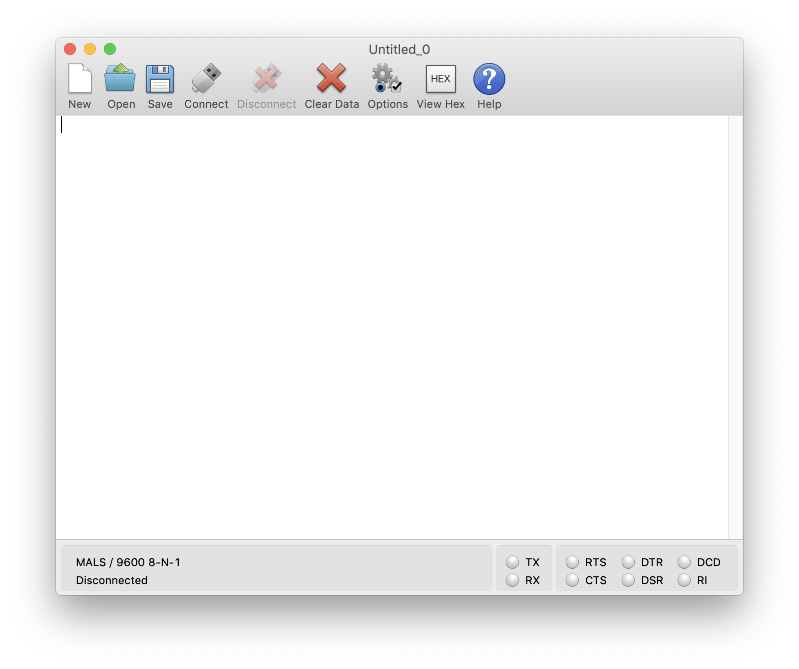

# Debug Serial Usage

- [Debug Serial Usage](#debug-serial-usage)
  - [`zephyr-tools-monitor`](#zephyr-tools-monitor)
  - [nRF Connect For Desktop - LTE Link Monitor](#nrf-connect-for-desktop---lte-link-monitor)
  - [CoolTerm](#coolterm)

The nRF9160 Feather comes with an on-board Silicon Labs CP2102 USB-to-UART chip. You can use it with most serial terminal viewers. If you have an older version of Windows you will have to install the driver. [The download is located here.](https://www.silabs.com/products/development-tools/software/usb-to-uart-bridge-vcp-drivers)

Here's some recommendations for software to communicate with the nRF9160 Feather. No matter what program you use, the standard baud rate for the console is 115200. All other options are standard/default (8 bits, oon-pairty, 1 stop bit).

## `zephyr-tools-monitor`

`zephyr-tools-monitor` comes with the Zephyr Tools VSCode Plugin. Here is the help dialog:

```
❯ zephyr-tools-monitor --help
App
USAGE:
  app [OPTIONS]
FLAGS:
  -h, --help            Prints help information
OPTIONS:
  --list, -l            Lists serial ports avaiable
  --follow,             Follow serial port if it disconnects
  --port,               Port to connect to
  --baud,               Baud to use (default 115200)
ARGS:
  <INPUT>
```

Typical usage includes:

* List all available ports use:

  ```
  ❯ zephyr-tools-monitor -l
  ["/dev/tty.URT2","/dev/tty.URT1","/dev/tty.BLTH","/dev/tty.Bluetooth-Incoming-Port","/dev/tty.usbmodem0009600833633","/dev/tty.usbmodem0009600833631","/dev/tty.usbmodem0009600833635","/dev/tty.SLAB_USBtoUART","/dev/tty.usbserial-14530"]⏎  
  ```

* A typical connection attempt:

  ```
  ❯ zephyr-tools-monitor --port /dev/tty.SLAB_USBtoUART --follow
  ```

If you'd like to download `zephyr-tools-monitor` standalone you can do so by downloading the [pre-built binary here](https://github.com/circuitdojo/zephyr-tools-monitor/releases).

## nRF Connect For Desktop - LTE Link Monitor

If you haven't already, make sure you check out the [LTE Link Monitor](nrf9160-nrf-connect-desktop.md#lte-link-monitor). It's a great multi-purpose tool for using and debugging the nRF9160 Feather.

## CoolTerm



CoolTerm has been my go-to for testing and debugging. Fortunately it's also multi-platform! You can download it by going here: https://www.freeware.the-meiers.org