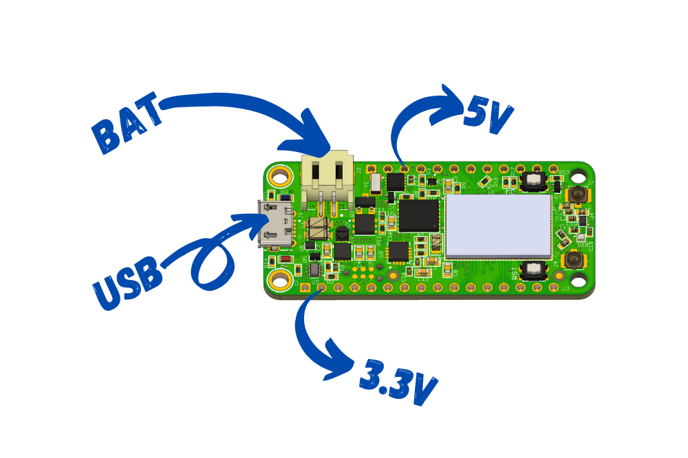
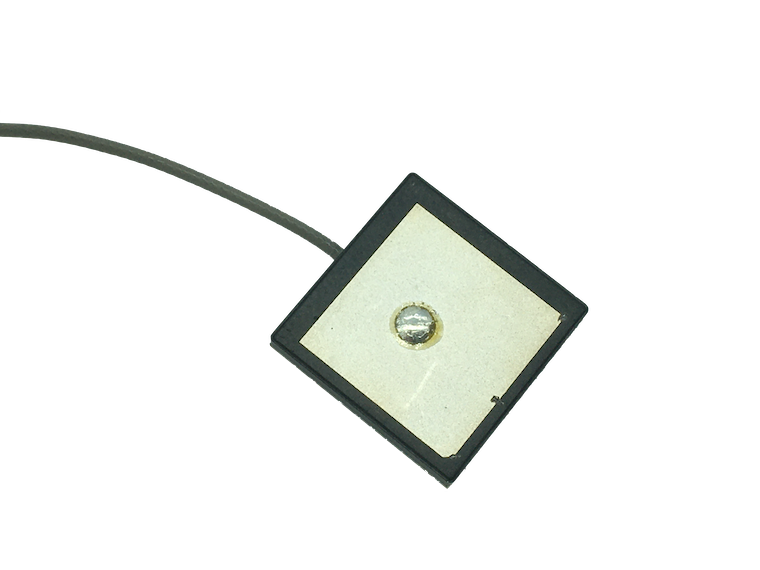

# Specifications and Requirements

## Technical Details

* Nordic nRF9160*
  * Microcontroller
    * ARM Cortex M33
    * 1MB Flash
    * 256kB RAM
    * ARM® TrustZone®
    * ARM® Cryptocell 310
    * Up to 4x SPI, I2C and UART with Easy DMA
    * I2S w/ EasyDMA
    * 4x PWM with EasyDMA
    * 12bit SADC with EasyDMA
    * 2x RTC
    * PPI (Programmable peripheral interconnect) interface
  * Radio
    * Transceiver and baseband
    * 3GPP LTE release 13 Category M1 and NB1 compliant
    * 3GPP release 14 NB2 compliant
    * GPS receiver (GPS L1 C/A supported) - Active antenna only.
    * RF Transceiver for global coverage supporting bands:
      *  Cat-M1: B1, B2, B3, B4, B5, B8, B12, B13, B14, B17, B18, B19, B20, B25, B26, B28, B66
       *  Cat-NB1/NB2: B1, B2, B3, B4, B5, B8, B12, B13, B17, B18, B20, B25, B26, B28, B66
    *  Supports 4FF Nano SIM
* Micro USB connection for USB-to-Serial and DFU
* Pre-programmed MCUBoot bootloader
* External NOR Flash by Winbond
  * ~~2MB~~ 4MB of space (Upgraded for all boards as of August 2, 2020!)
  * Max bus speed of 133MHz
  * Standard SPI
* Power supply
  * 3.3V Buck/Boost up to 0.9A of current draw
  * Operating range 2.8 to 5.5V
  * External LiPoly battery connection (JST SPH type)
  * LiPoly set to 300mA with indication
* Programmer
  * Capable of interfacing with Jlink and CMSIS-DAP based programmers
  * Use with a Tag Connect TC2030-CTX-NL over Serial Wire Debug (SWD)
* Low Power RTC on board for time keeping and as a low power wakeup source.
* User I/O
  * Standard feather form factor GPIOs (0.1" pitch)
  * 2x buttons (1 Reset, 1 General Purpose)
  * 1x Blue LED connected to D7
* Antenna connections:
  * 1x U.FL for LTE with matching network
  * 1x U.FL for active GPS antennas
* Feather form factor
  * 50.8mm x 22.86mm (2" x 0.9")

*\* nRF9160 tech specs provided from the nRF9160 Product Specification*

## Electrical

Here are the elctrical specifications for the nRF9160 Feather. Most of the specifications here are based on the nRF9160 Product Specification. You can get the latest version of the [nRF9160 Product Specification here.](https://infocenter.nordicsemi.com/pdf/nRF9160_PS_v1.2.pdf) All previous versions can be [found here.](https://infocenter.nordicsemi.com/index.jsp?topic=%2Fstruct_nrf91%2Fstruct%2Fnrf9160.html&cp=2_0)

### Board Supply

- **Output voltage:** 3.3V ± 0.3V
- **Max output current:** 800mA
- **Off current w/ Low Power RTC:** < 3µA

### Pin Ratings (MD/A0-A5/D0-D8/TX/RX/CIPO/COPI/SCK/RST)

- **Max input voltage:** 3.6V

### Enable Pin

- **Max input voltage:** 8V¹

¹Enable pin is *active low.*

### External Power Supply

The nRF9160 Feather can be powered via battery or USB. See below for the specifics for each power source

### USB Requirements

- **Operating range:** 5V ± 0.2V
- **Current requirements:** >500mA

### Battery Requirements

- **Battery type:** LiPoly
- **Operating range:** 2.8-5.5V
- **Current/power rating:** Able to support at least 2W of power
- **Battery capacity:** > 300mAH²
- **Charging current:** 294mA ± 10%

²*Batteries below this capacity are not recommended nor supported.*

### GPS Antenna

The U.FL port on the nRf9160 Feather is to be used with an **active GPS antenna only.**

- **Antenna supply voltage:** 3.3V ± 0.3V
- **Antenna current rating:** 15mA

The port works with most U.FL based active antenna parts. The nRF9160 Feather has been tested
and verified with the following parts:

| Part Number     | Manufacturerer   | Datasheet            | Notes               |
| --------------- | ---------------- | -------------------- | ------------------- |
| ACTPAT182-01-IP | Inventek Systems | [Link][actpat182-ds] | Offered as an addon |

[actpat182-ds]: https://static6.arrow.com/aropdfconversion/422c439d1147508166bb2a384ddf266b0a8da68b/2actpat182_functional_specification.pdf

### Cellular Antenna

The nRF9160 Feather has been tested with these approved antennas. They're chosen specifically to match the FCC requirements as indicated [here.](https://apps.fcc.gov/oetcf/tcb/reports/Tcb731GrantForm.cfm?mode=COPY&RequestTimeout=500&tcb_code=&application_id=5jPUJx5%2Bvjp3BKCESrEhWw%3D%3D&fcc_id=2ANPO00NRF9160)

| Part Number     | Manufacturerer        | Datasheet                  | Notes           |
| --------------- | --------------------- | -------------------------- | --------------- |
| FH2B4MH1F2F0100 | Unictron Technologies | [Link][uni-ds]             | Included        |
| ANT-LTE-RPC-UFL | Linx                  | [Link][ant-lte-rpc-ufl-ds] | GPS/GNSS, Rigid |

[uni-ds]: https://www.unictron.com/wp-content/uploads/H2B4MH1F2F0100.pdf
[uni-pricing]: https://octopart.com/h2b4mh1f2f0100-unictron-93186548?r=sp
[ant-lte-rpc-ufl-ds]: https://linxtechnologies.com/wp/wp-content/uploads/ant-lte-rpc-ccc-ds.pdf

**Only tested antennas are supported**. If you choose to use a different one, proceed at your own risk!